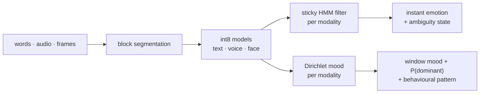

# Lightweight multimodal emotion detection (edge)

On-device emotion recognition from **text, voice prosody and facial expression**. The system has five layers:

1. **Compact int8 models**, one per modality. The text model is DistilBERT fine-tuned on `dair-ai/emotion`, quantized only after it passes a 90 % accuracy gate.
2. **Block segmentation**, which decides when a sentence, voiced segment or frame is complete and ready for analysis.
3. **A temporal layer**, which gives an **instant emotion** (sticky HMM filter) and an **overall mood over a time window** (Dirichlet evidence, with the probability that the mood label is right), plus a **behavioural pattern** (stable / shifting / volatile / escalating / de-escalating / flat / incongruent).
4. **Probabilistic late fusion**, which weights each modality by its calibrated confidence and input quality and flags ambiguity as `confident`, `blend`, `ambiguous`, `conflict` or `uncertain`.
5. **Edge simulation**: core pinning, contention, memory cap and queueing load tests.


*Synthetic demo session: raw readings per modality (dots) become a stable fused instant emotion (bottom strip). Masked anger (text says joy, face and voice say anger) is flagged as `conflict` (red squares).*



## Status

| | |
|---|---|
| Real DistilBERT accuracy on dair-ai/emotion | **Not measured yet.** The build sandbox blocked `huggingface.co`. Run `make real-text` or `notebooks/colab_text_run.ipynb` |
| Edge size and latency (full DistilBERT architecture) | Measured: 268 MB → **56.5 MB**; 40.8 → **15.2 ms** per 32-token input on one core (random weights; timing and size are weight-independent) |
| Voice and face models | **Trained on real CREMA-D audio+video** (15 unseen test actors): voice 54.0 % (humans by voice only: 46.7 %), face 56.9 % (humans: 70.2 %), **fused 68.4 %** (humans with audio+video: 76.5 %); int8 costs no accuracy |
| Fusion and temporal layer | **Real data:**<br/>• fusion is calibrated (ECE 0.04) and can answer 38 % of clips at 90 % accuracy while flagging the rest<br/>• the temporal layer cuts label flicker 3x but does not raise instant accuracy<br/>• the mood P(dominant) is calibrated (ECE 0.06-0.07)<br/>• the `conflict` signal is **not validated** (AUROC 0.52)<br/>Details in [docs/REAL_DATA_STUDY.md](docs/REAL_DATA_STUDY.md) |
| Tests | 29 passing (`make test`) |


*Real recordings (CREMA-D, 15 unseen actors): the voice model beats human raters judging by voice alone, the face model trails them, and calibrated late fusion adds 11.5 points over the best single modality.*

## Quickstart

```bash
pip install -r requirements.txt
make test          # 27 tests, no network needed
make live-demo     # end-to-end live pipeline on a scripted session: prints readings, writes JSONL, figures, evaluation
make smoke         # text training pipeline on synthetic data (code path only, NOT a result)
make arch edge latency fusion report     # edge numbers, fusion study, docs/RESULTS.md
make real-text     # real DistilBERT run (needs huggingface.co, or DATA_DIR + MODEL for offline use)
make real-meld MELD=/path/to/meld                  # MELD text study (CSV files from github.com/declare-lab/MELD)
make real-cremad CREMAD=/path/to/cremad           # CREMA-D voice+face study (github.com/CheyneyComputerScience/CREMA-D)
```

Live on your own recordings or devices (see [docs/LIVE_PIPELINE.md](docs/LIVE_PIPELINE.md)):

```bash
python scripts/live.py files --video s.mp4 --audio s.wav --transcript s.jsonl --text-onnx ... --face-onnx ... --speech-onnx ...
python scripts/live.py realtime --seconds 120 --camera 0 ...
```

Library use:

```python
from emotion_edge.live.pipeline import LivePipeline
p = LivePipeline(text=my_text_model, speech=my_speech_model, face=my_face_model, sink=print)
p.run(events)          # records: "block", "instant" (every 0.5 s), "window" (every 5 s)
```

## Documentation

| Document | What's in it |
|---|---|
| [docs/TECHNICAL_DOCUMENTATION.md](docs/TECHNICAL_DOCUMENTATION.md) | Full what / why / how: architecture, text training and the 90 % gate, compression variants, edge simulation, voice and face tracks, fusion, a 23-item decision log, limitations, glossary, references |
| [docs/TEMPORAL_DESIGN.md](docs/TEMPORAL_DESIGN.md) | Block segmentation rules, text strategy decision, sticky HMM filter, Dirichlet mood with P(dominant), behaviour metrics (affect-dynamics literature), parameter rationale, evaluation |
| [docs/LIVE_PIPELINE.md](docs/LIVE_PIPELINE.md) | Running demo / files / real time, input formats, output record schemas, one-core compute budget |
| [docs/REAL_DATA_STUDY.md](docs/REAL_DATA_STUDY.md) | Real human-labelled validation on CREMA-D and MELD: models vs human raters, fusion and ambiguity vs human judgement, temporal retuning, and what changed as a result |
| [docs/RESULTS.md](docs/RESULTS.md) | All measured numbers and graphs, regenerated from result files |

## Layout

| Path | Purpose |
|---|---|
| `emotion_edge/text` | Data loading, DistilBERT training, vocabulary pruning, int8 embeddings, gated pipeline CLI |
| `emotion_edge/speech`, `emotion_edge/vision` | Prosody features + MLP; Haar face detection + mini-Xception CNN; int8 ONNX export |
| `emotion_edge/fusion` | Calibrated late fusion + ambiguity typing; synthetic validation and threshold tuning |
| `emotion_edge/temporal` | Segmenters, sticky filter, Dirichlet mood, behaviour metrics, session, evaluation, figures |
| `emotion_edge/live` | Sources (files, webcam, mic), ONNX predictors, the live pipeline, the demo scenario |
| `emotion_edge/edge` | Edge scenarios and queueing load test |
| `scripts/` | `live.py`, `run_text.sh`, benchmarks, fusion study, `run_speech_face.md` (dataset instructions) |
| `tests/`, `.github/workflows/ci.yml` | Unit, round-trip and integration tests, run on every push |

Datasets are not bundled: dair-ai/emotion (Hugging Face), RAVDESS or CREMA-D (speech), FER2013 (face).

**Responsible use:** outputs describe *expressed* affect probabilistically, not inner states. Run on device, with consent.
