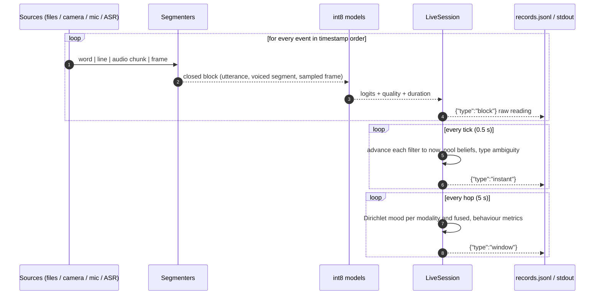

# Live pipeline: operations guide

How to run the end-to-end system on recorded files, a webcam and microphone, or the built-in demo; what goes in and what comes out; and what it costs on an edge CPU. Design rationale is in [TEMPORAL_DESIGN.md](TEMPORAL_DESIGN.md); model training is in [TECHNICAL_DOCUMENTATION.md](TECHNICAL_DOCUMENTATION.md).

---

## 1. Data flow



There is one clock. Offline files are **replayed in timestamp order** (`heapq.merge` of the per-source event streams), so a file run takes exactly the same code path as a live run and is deterministic. That makes it the way to test and tune.

---

## 2. Running it

### 2.1 Demo (no models or data needed)

```bash
python scripts/live.py demo --out results/live_demo
```

This runs the scripted synthetic session (neutral, joy, masked anger, sadness, escalation to fear, joy/love blend; face missing for 6 s) and does three things:
- prints the instant and window readings,
- writes `records.jsonl`,
- regenerates every figure in `docs/figures/live_*.png`, `segmentation.png`, `mood_dirichlet_t60.png` and `temporal_eval.png`, plus the 10-seed evaluation in `results/temporal_eval.json`.

Example output:

```
[   30.0s] WINDOW  mood neutral  transition neutral->joy  P(dominant)=0.46  pattern=stable  conflict_share=0.00
[   45.0s] WINDOW  mood joy      dominant  P(dominant)=0.88  pattern=stable  conflict_share=0.00
[   60.0s] WINDOW  mood joy      conflicted  P(dominant)=0.58  pattern=volatile,escalating,incongruent  conflict_share=0.28
[   80.0s] WINDOW  mood sadness  transition anger->sadness  P(dominant)=0.68  pattern=de-escalating  conflict_share=0.23
[  105.0s] WINDOW  mood fear     transition sadness->fear  P(dominant)=0.45  pattern=escalating  conflict_share=0.00
```

### 2.2 Recorded files

```bash
python scripts/live.py files --out results/session1 \
  --video session1.mp4 --audio session1.wav --transcript session1.jsonl \
  --text-onnx   artifacts/text/model_pruned_int8_emb8.onnx --tokenizer artifacts/text/torch_fp32 \
  --remap       artifacts/text/vocab_remap.npy           --text-results artifacts/text/results.json \
  --speech-onnx artifacts/speech/prosody_int8.onnx       --speech-results artifacts/speech/results.json \
  --face-onnx   artifacts/face/face_int8.onnx            --face-results artifacts/face/results.json
```

- Any subset of `--video / --audio / --transcript` works. A modality whose model flag is missing is skipped.
- The `--*-results` files supply the calibration temperature fitted during training.
- Outputs are `records.jsonl`, `timeline.png` and `mood.png`.

### 2.3 Real time

```bash
pip install sounddevice            # microphone capture (optional dependency)
python scripts/live.py realtime --seconds 120 --camera 0 --out results/rt [model flags as above]
```

Camera frames and microphone chunks are produced on capture threads and consumed on one processing thread. Text needs an ASR producing `word` events, or typed lines, so in this mode it is typically fed by an external ASR. Plug one in by yielding `Event(t, "word", {"word": ..., "speaker": ...})` from a generator and merging it with `realtime_events`.

### 2.4 Options

| Flag | Default | Meaning |
|---|---|---|
| `--window` | 30 | Mood window length (s) |
| `--hop` | 5 | How often a window report is produced (s) |
| `--tick` | 0.5 | Instant update period (s) |
| `--quiet` | off | Don't print, only write JSONL |
| `--seed` | 0 | Demo scenario seed |

Per-modality temporal parameters (dwell, τ_c, base weight) are in `emotion_edge/temporal/session.py::DEFAULTS`. Ambiguity thresholds are in `SessionConfig.thresholds`.

---

## 3. Input formats

| Source | Format | Notes |
|---|---|---|
| Transcript (ASR) | JSONL, one word per line: `{"t": 8.4, "word": "really", "speaker": "A"}` | `t` = word end time (s). Punctuation on the word drives sentence-end closure |
| Transcript (chat) | JSONL, one message per line: `{"t": 10.0, "text": "i am so done with this"}` | A line is closed as one block if it has >= 3 words |
| Audio | Any format librosa reads; resampled to 16 kHz mono | Streamed in 100 ms chunks |
| Video | Anything OpenCV reads | Down-sampled to 4 fps for analysis |
| Pre-computed | `Event(t, "block", {"modality", "logits" or "probs", "quality", "dur"})` | Use external models, or replay stored model outputs |

---

## 4. Output records

Every record is one JSON line. These examples are real records from the demo run, shortened. Text and timing fields of the block example are elided, because the demo feeds pre-computed outputs.

### 4.1 `block`: one analysed unit (raw, unsmoothed)

```json
{"type": "block", "t": 34.192, "modality": "text", "raw_label": "joy", "raw_p": 0.607, "quality": 1.0, "dur": 1.0,
 "text": "...", "closed_by": "sentence_end", "proc_ms": "..."}
```

`closed_by` records *why* the segmenter closed the block (`sentence_end`, `pause 1.9s`, `max_words`, `speaker_change`, `idle`, `max_len`, `flush`). `proc_ms` is the model and feature time for that block.

### 4.2 `instant`: every tick

```json
{"type": "instant", "t": 55.0, "label": "anger", "state": "conflict", "p_top1": 0.877, "top2": ["anger", "neutral"],
 "margin": 0.828, "entropy": 0.256, "conflict": 0.602,
 "per_modality": {"speech": {"top": "neutral", "p_top": 0.301, "reliability": 0.163},
                  "face":   {"top": "anger",   "p_top": 0.921, "reliability": 0.792},
                  "text":   {"top": "joy",     "p_top": 0.631, "reliability": 0.406}},
 "explanation": "modalities disagree: speech->neutral; face->anger; text->joy",
 "posterior": {"anger": 0.877, "...": "..."}}
```

- `reliability` here is the filter's informativeness. Text has carry 0, so its reading reflects the latest utterance only (0.41 here). A modality that has gone quiet trends toward 0. In this record, voice is nearly uninformative (0.16): its last segments were weak or a while ago, so it barely counts.
- `state` is one of `confident`, `blend`, `ambiguous`, `conflict` or `uncertain`.

### 4.3 `window`: every hop

```json
{"type": "window", "t": 65.0, "window_s": 30.0,
 "moods": {"face": {"label": "anger", "state": "transition", "transition": ["joy", "anger"], "second": "joy",
                    "n_eff": 9.13, "p_dominant": 0.541, "mixture": {"anger": 0.295, "joy": 0.159, "...": 0},
                    "ci90": {"anger": [0.103, 0.531], "...": []}},
           "text": {"...": "..."}, "speech": {"...": "..."}},
 "fused_mood": {"label": "joy", "state": "transition", "transition": ["joy", "anger"], "n_eff": 14.14,
                "p_dominant": 0.413, "cross_modal_jsd": 0.075, "p_incongruent": 0.391, "incongruent_pair": ["face", "text"],
                "modality_leaders": {"speech": "anger", "face": "anger", "text": "joy"}, "...": "..."},
 "behaviour": {"fused": {"valence_mean": 0.107, "arousal_mean": 0.541, "valence_mssd": 0.024,
                         "valence_inertia": 0.941, "valence_trend_per_min": -3.596, "switch_per_min": 8.0,
                         "dominant": "anger", "dominant_share": 0.475, "tags": ["volatile", "incongruent"]},
               "face": {"...": "..."}},
 "conflict_share": 0.311}
```

How to read this record: over the last 30 s the person moved from joy to anger. Text kept saying joy while face and voice said anger for about a third of the window (`conflict_share` 0.31, at least 0.3), so the window is tagged `incongruent`, the signature of masking or sarcasm. `p_incongruent` (0.39) gives the window-level probability that face and text lead with opposite-valence emotions. **Note:** these incongruence signals are not yet validated on real data (REAL_DATA_STUDY section 3).

---

## 5. Compute budget (one core)

Measured on one pinned host core (x86). The neural networks use random weights here, which is valid for timing, not accuracy. An earlier version of this table gave 45 ms for face detection; that figure included reloading the Haar cascade on every frame, a bug found and fixed during the real-data study.

| Stage | Cost | Frequency | Load on one core |
|---|---|---|---|
| Face: Haar detection + crop (320x240) | ~20-30 ms | 4 fps | ~8-12 % |
| Face: CNN int8 | ~0.5 ms | 4 fps | < 0.3 % |
| Voice: prosody features (3 s segment) | ~30 ms | per segment (~every 3-5 s) | ~1 % |
| Voice: MLP int8 | < 0.1 ms | per segment | ~0 |
| Text: DistilBERT int8, 32 tokens | ~15 ms | per utterance (~every 4-8 s) | < 0.5 % |
| Temporal: observe (per block) | 0.09 ms | ~5 / s | ~0 |
| Temporal: tick (fuse filters) | 0.22 ms | 2 / s | < 0.1 % |
| Temporal: window report (Dirichlet sampling, CIs, behaviour) | 21 ms | every 5 s | ~0.4 % |
| **Total** | | | **~10-14 % of one core** |

Face detection dominates. If the budget is tight, the levers are, in order:
1. Lower the face rate to 2 fps (the filter's dwell absorbs it).
2. Detect every Nth frame and track the box in between.
3. Shrink the detection input.

The neural networks themselves are not the bottleneck.

---

## 6. Extending

| Task | Where |
|---|---|
| Swap in another model for a modality | Implement a callable returning `(logits, quality, ms)` (or `(logits, ms)` for text) and pass it to `LivePipeline` |
| Add a modality (for example physiological signals) | Add its label set and mapping matrix to `labels.py`, its defaults to `session.DEFAULTS`, and emit `block` events |
| Change segmentation | `TextSegmenter`, `AudioSegmenter` and `FrameSampler` fields, all documented in `temporal/segment.py` |
| Consume results in an app | Pass `sink=callable` to `LivePipeline`: every record is delivered as it is produced |
