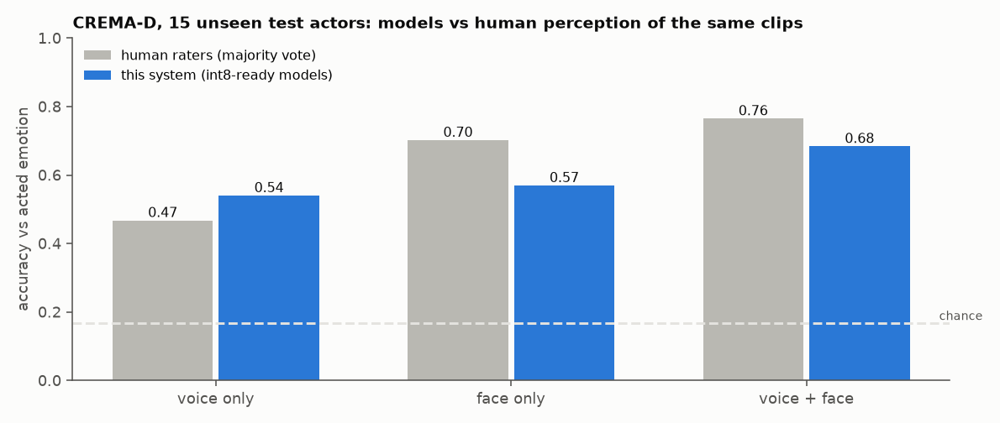
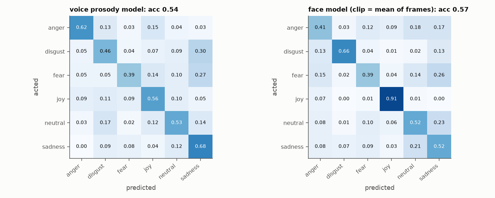
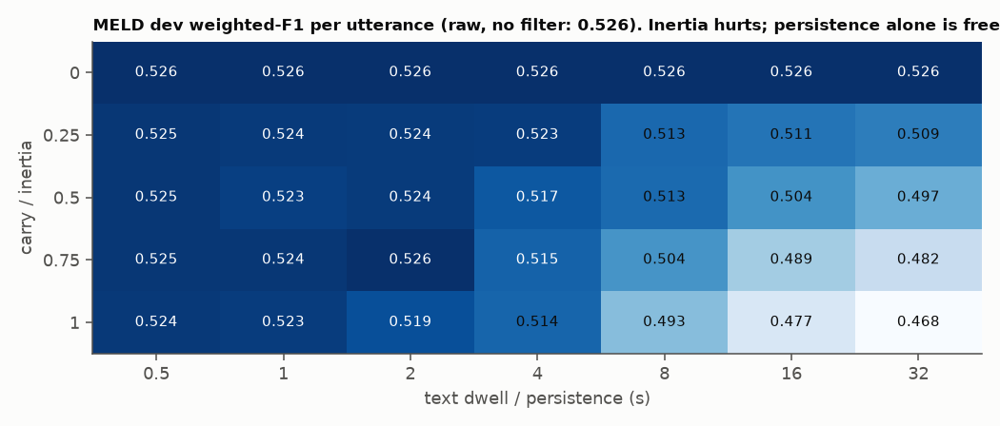
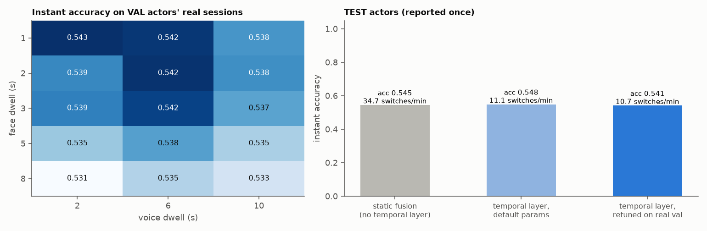
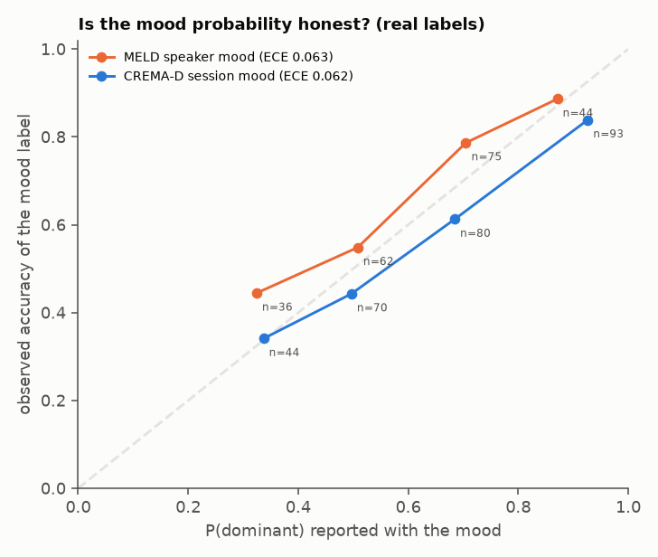
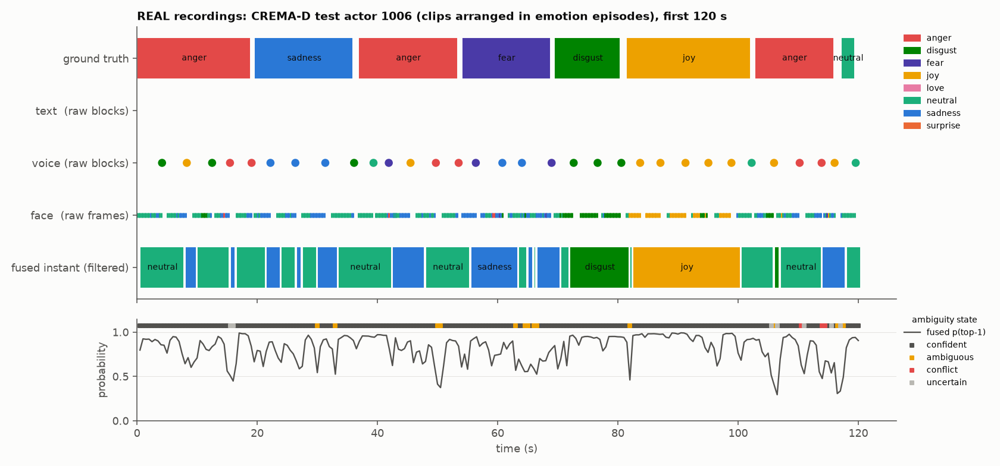

# Real-data study: retuning and validating on human-labelled recordings

Until this study, the fusion and temporal layers had only been checked on synthetic data. This document reports what happened when they met **real recordings with human labels**: what held up, what did not, and what was changed as a result.

**Data used (both reachable from the build sandbox):**
- **CREMA-D** (Cao et al., 2014; ODbL licence; official GitHub repository with LFS files): 7,442 audio+video clips from 91 actors, 6 emotions. Every clip was also rated by crowd workers *separately* for voice-only, face-only and audio-visual presentation, about 9 raters each.
- **MELD** text (Poria et al., 2019; official GitHub repository): 13,708 utterances from multi-party TV conversations, each labelled with one of 7 emotions, with speaker and timestamps.

**Not done, and why:**
- **DistilBERT on dair-ai/emotion:** `huggingface.co` is blocked, and dair-ai's own GitHub repository links back to the Hub rather than hosting the data.
- **RAVDESS:** Zenodo is blocked.
- **FER2013:** Kaggle is blocked.
- **MELD audio/video:** the university host is blocked.
- **Your own recordings:** none were provided. Section 6 says what to record.

Reproduce with:
```bash
python scripts/real_cremad_extract.py --root <cremad> --out <feats>      # 88 prosody features/clip, face crops at 4 fps
python scripts/real_cremad.py --root <cremad> --feats <feats> --out <models>
python scripts/real_meld.py --root <meld>
python scripts/real_figures.py --root <cremad> --feats <feats> --models <models>
```
Results: `results/real_cremad.json`, `results/real_meld.json`.

**Protocol.**
- CREMA-D is split **by actor**: 61 actors train, 15 validation, 15 test. Every choice (epochs, restarts, temperatures, thresholds, temporal parameters) is made on validation actors; test actors are evaluated once.
- MELD uses its official train / dev / test splits; choices are made on dev.

---

## 1. Unimodal models on real data



| Model (test actors, 6 classes, chance 17 %) | Accuracy | Macro-F1 | int8 accuracy | int8 agrees with fp32 | Size | Humans on the same clips |
|---|---|---|---|---|---|---|
| Voice prosody MLP (88 features, 29 k params) | **54.0 %** | 0.539 | 55.2 % | 90.6 % | 0.035 MB | 46.7 % (voice only) |
| Face mini-Xception (66 k params; clip = mean of ~10 frames) | **56.9 %** | 0.567 | 57.3 % | 98.6 % | 0.10 MB | 70.2 % (face only) |

What this shows:
- **The voice model beats human raters** at recovering the *acted* emotion from voice alone (54 % vs 47 %). Humans find voice-only emotion hard: over all 7,442 clips their majority vote matches the acted label only 45.5 % of the time.
- **The face model trails humans by 13 points.** It recognises joy well (recall 0.91) but anger and fear poorly (0.41 and 0.39). A 66 k-parameter CNN on 48x48 grayscale crops, trained on 61 actors, is the main accuracy bottleneck.
- **int8 costs nothing measurable** on either model (+1.2 and +0.4 points; differences within noise).
- **Calibration:**
  - Voice: temperature 1.42, ECE 0.122 → 0.081 after temperature scaling.
  - Face, frame level: temperature 1.57, ECE 0.130 → 0.014.
  - Face, clip level: already calibrated (ECE 0.039).



---

## 2. Fusion on real clips

Voice and face are fused per clip with the same calibrated log-opinion pool used everywhere else (`fusion/fuse.py`).

| Test actors (1,224 clips) | Value |
|---|---|
| Fused accuracy vs acted emotion | **68.4 %** (macro-F1 0.683): **+11.5 points** over the best single modality |
| Humans watching audio+video, same clips | 76.5 % |
| Fused ECE vs acted label | **0.039**: probabilities can be taken at face value |
| Brier score vs the human audio-visual vote distribution | 0.259, versus 0.361 for a one-hot "acted label" |

The last row needs one sentence of interpretation. The fused probabilities are *closer to how people actually perceive the clip* than the acted label itself is. Where humans split their votes, so does the model.

**Conclusion:** late probabilistic fusion delivers on real data. Two weak modalities (54 % and 57 %) combine into a calibrated 68 %, without any joint training.

---

## 3. Ambiguity and conflict against human judgement

CREMA-D's rater votes give two real ground truths:
- **Human-ambiguous:** fewer than 60 % of audio-visual raters agree. This is 27.5 % of test clips.
- **Human-incongruent:** voice-only raters and face-only raters were each fairly confident (60 % or more agreement) but chose *different* emotions. This is 14.5 % of test clips.


| Question | AUROC (test) | Verdict |
|---|---|---|
| Does low fused confidence (1 - p_top) predict the model's own errors? | **0.79** | Yes, useful |
| Does it predict clips humans find ambiguous? | 0.64 (entropy: 0.63) | Partly |
| Does the cross-modal `conflict` signal predict human voice/face disagreement? | **0.52** | **No.** Chance level |

**Thresholds retuned on real validation actors** (objective: flag a clip when the model is wrong or humans are ambiguous):

| Threshold source | Answered as `confident` | Accuracy when answered | Accuracy when flagged | Human-ambiguous share: answered / flagged |
|---|---|---|---|---|
| Default | 51.9 % | 84.3 % | 51.3 % | 21 % / 34 % |
| Tuned on synthetic data | 36.7 % | 88.6 % | 56.6 % | 18 % / 33 % |
| **Tuned on real validation actors** | 37.8 % | **90.1 %** | 55.2 % | **15 % / 35 %** |

The real-tuned thresholds are `conf_p 0.7, margin 0.1, entropy 0.6, conflict_jsd 0.5`.

**What changes:**
1. **Selective answering works on real data.** The system can answer about 38 % of clips at about 90 % accuracy and flag the rest. Flagged clips are more than twice as likely to be ones humans also found ambiguous.
2. **Synthetic tuning transferred reasonably** (88.6 % vs 90.1 %). The real-tuned thresholds still replace it as the recommended setting, because they come from real data.
3. **The clip-level `conflict` state is NOT validated.** On CREMA-D it does not detect human-perceived voice/face disagreement. One plausible reason is that CREMA-D actors were not masking: disagreement between voice-only and face-only raters mostly reflects how hard voice is to read (humans 45.5 %), not a person expressing two different things. Either way, `conflict` and `incongruent` should be treated as **unvalidated** until tested on data with real masking or sarcasm, such as MUStARD (Castro et al., 2019). The real-tuned thresholds make `conflict` rare (3.7 % of clips) and route most doubt to `uncertain`.

---

## 4. Temporal layer on real recordings

### 4.1 Text in real conversations (MELD)

**Text model:** TF-IDF (word 1-2 grams + character 2-5 grams) with logistic regression, used because pretrained transformers are unreachable from the sandbox. On test: **60.5 % accuracy, weighted F1 0.562** (majority-class baseline 48.1 %). Published text-only transformer models report weighted F1 of roughly 0.6 or more on MELD; this is a lightweight stand-in.

**Does temporal smoothing help per utterance?** No:



- **Raw (no filter): 0.526** weighted F1 on dev.
- With a classic sticky filter (carry = 1), F1 **falls** as dwell grows: 0.524 at 0.5 s down to 0.468 at 32 s.
- In MELD, a speaker's next utterance keeps the same human label only **44 %** of the time, so conversational emotion has little inertia from one utterance to the next.
- With **carry = 0**, F1 equals raw (0.526) at *every* dwell. Letting a reading persist is free; letting it bias the interpretation of the next utterance is not.

**Change made:** the filter now has two parameters instead of one.
- **dwell (persistence):** how long a reading stays relevant.
- **carry (inertia):** how much the previous state shapes the next interpretation.

Text defaults are now **dwell 10 s, carry 0**. Each utterance is judged on its own, and its reading stays available for 10 s to compare with face and voice.

**Cost of this change, measured on the synthetic benchmark:**
- Instant masking detection falls from 0.70 to 0.25 (`results/temporal_eval.json`). In that scenario the masking signal came from text *accumulating* over several utterances.
- Window-level `incongruent` tagging falls from 0.56 to about 0.25, with zero false alarms.
- **This was accepted deliberately.** Real data beats a simulator, and section 3 already found the conflict signal unvalidated. It is listed as an open problem.

**Window mood on real labels.** For each (dialogue, speaker) pair with 4 or more utterances and a single dominant human label (217 cases):

| Method | Accuracy |
|---|---|
| Dirichlet mood | 0.682 |
| Majority vote of raw predictions | 0.696 |
| Always "neutral" | 0.668 |

Accuracy is barely above the neutral baseline; that is a text-model limit. **But the mood probability is honest:**

| P(dominant) bin | Observed accuracy |
|---|---|
| 0.2-0.4 | 0.44 |
| 0.4-0.6 | 0.55 |
| 0.6-0.8 | 0.79 |
| 0.8-1.0 | 0.89 |

Calibration error 0.063. The `dominant` state is right 89 % of the time; the `conflicted` state is right 41 % of the time. Users can trust the probability attached to the mood, even where the label itself is often wrong.

### 4.2 Voice + face over time (CREMA-D sessions)

CREMA-D clips are single sentences, so **sessions were assembled from real clips**. For each actor, the clips were arranged into emotion episodes (3-6 clips of one acted emotion, then another), with 0.3-1.2 s gaps. This gives 15 validation and 15 test sessions of about 4.5 minutes each.
- **Real:** the audio, the face frames at their real timestamps, and the model outputs.
- **Constructed:** the episode structure.

The voice model's reading becomes available at the *end* of each sentence, as it would live.



| Test actors | Instant accuracy | Label switches per minute | Median transition latency | Mood accuracy (20 s window) | P(dominant) ECE |
|---|---|---|---|---|---|
| Static per-tick fusion | 0.545 | 34.7 | | | |
| Temporal layer, default parameters | **0.548** | **11.1** | 1.2 s | 0.634 | 0.074 |
| Temporal layer, retuned on validation (face dwell 3, voice dwell 2, τ_c 0.5) | 0.541 | 10.7 | 1.1 s | 0.603 | 0.062 |

**What changes:**
1. **On real data the temporal layer does not raise instant accuracy** (0.545 → 0.548), unlike the synthetic benchmark (0.76 → 0.96). It **does cut label flicker 3x** at about 1 s latency, which is what makes a live display usable.
2. **Instant accuracy (0.55) is well below clip-level fused accuracy (0.68).** That gap is the price of real time: at every 0.5 s tick, the voice reading still describes the *previous* sentence, and the face has seen only part of the current one.
3. **Retuning did not help on test.** Validation accuracy across all 30 settings lies between 0.531 and 0.543, so the layer is insensitive to its parameters on this data, and the retuned setting did slightly worse on test. **The defaults are kept.**
4. **Window length:**

   | Window | Validation mood accuracy | Windows scored |
   |---|---|---|
   | 10 s | 0.621 | |
   | 20 s | 0.639 | |
   | 30 s | 0.551 | 89 |

   The best window is tied to episode length, and the episodes here are constructed, so the 30 s default is kept. Set the window to the expected duration of a stable state in your use case.
5. **The mood probability is again roughly honest** on real recordings: P(dominant) bins observe 0.34, 0.44, 0.61 and 0.84 accuracy (ECE 0.06-0.07). It is slightly over-confident at the top.





*One test actor's session (real clips). The face model reads this actor's anger and fear mostly as neutral or sadness. Per-person variation is large, and a per-user calibration step would help.*

---

## 5. Changes made because of this study

| Change | Evidence |
|---|---|
| `StickyFilter.carry` (inertia) added, separate from `dwell_s` (persistence); text defaults dwell 10 s, carry 0 | MELD: any carry > 0 lowers per-utterance F1; carry 0 equals raw at every dwell |
| Window incongruence redefined as **P(opposite valence)** between modality leaders under their Dirichlet posteriors, recency-weighted, threshold 0.4 | The earlier V/A-distance rule counted neutral as "incompatible" (false-alarm rate 0.61 on the synthetic benchmark) |
| Real-tuned ambiguity thresholds documented as the recommended setting (`results/real_cremad.json` → `thresholds.tuned_on_real_val`) | 90 % accuracy on answered clips; flagged clips 2.3x more often human-ambiguous |
| `conflict` / `incongruent` marked **unvalidated** | AUROC 0.52 against human voice/face disagreement |
| Haar cascade cached per process | Was reloaded on every frame: real cost about 20-30 ms per frame, not 45 ms. The latency budget is corrected |
| Prosody feature count corrected to 88 | Earlier docs said about 130 |

---

## 6. What still needs your recordings

CREMA-D and MELD were the best real data reachable from here, but neither is the target setting. To finish validation:
1. **Record 10-20 sessions in the deployment setting** (same camera and microphone, real conversations, 5-15 min each, with consent).
2. **Annotate:**
   - continuous or per-utterance emotion (2-3 annotators),
   - a per-window mood label,
   - flags for *mixed*, *masked / sarcastic* and *escalating*.
3. **Run** `scripts/live.py files ...` on them.
4. **Re-run the threshold and temporal tuning** with those labels (the same code as `real_cremad.py`, with sessions loaded from the recordings).
5. **Validate `conflict` / `incongruent`** on the masked and sarcastic segments, or on MUStARD.
6. **Train the DistilBERT text model** once `huggingface.co` is reachable (`make real-text`), and replace the MELD TF-IDF stand-in.

---

### References
Cao, H., Cooper, D. G., Keutmann, M. K., Gur, R. C., Nenkova, A., & Verma, R. (2014). CREMA-D: Crowd-sourced emotional multimodal actors dataset. *IEEE Transactions on Affective Computing, 5*(4) ·
Poria, S., Hazarika, D., Majumder, N., Naik, G., Cambria, E., & Mihalcea, R. (2019). MELD: A multimodal multi-party dataset for emotion recognition in conversations. *ACL* ·
Castro, S., et al. (2019). Towards multimodal sarcasm detection (an obviously perfect paper). *ACL*.
