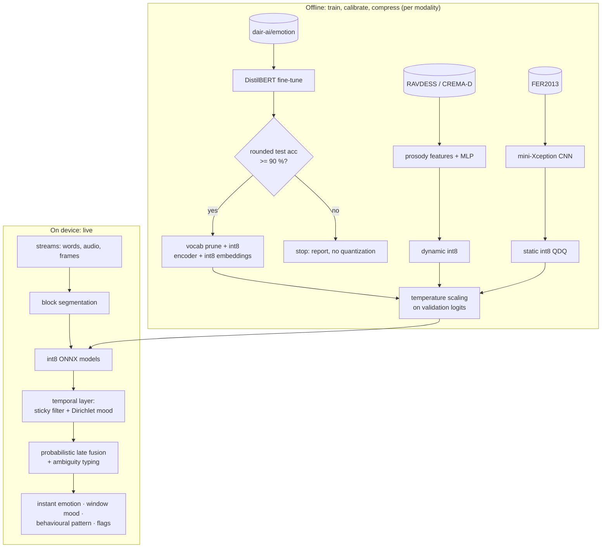
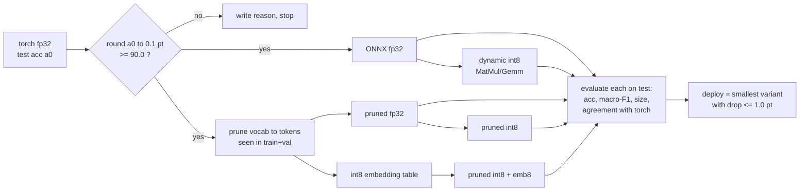
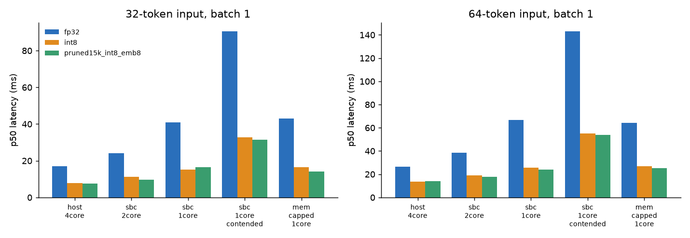
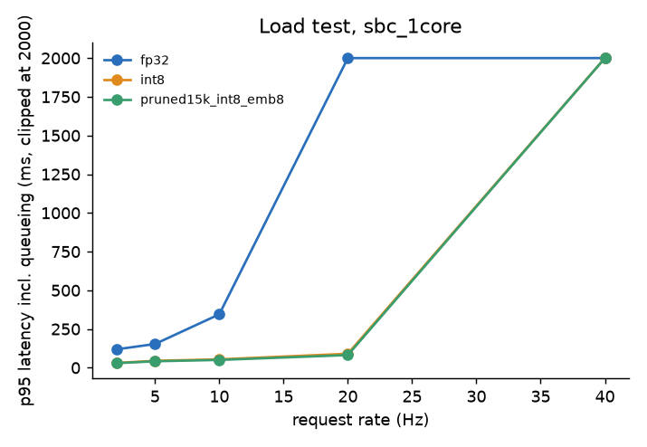
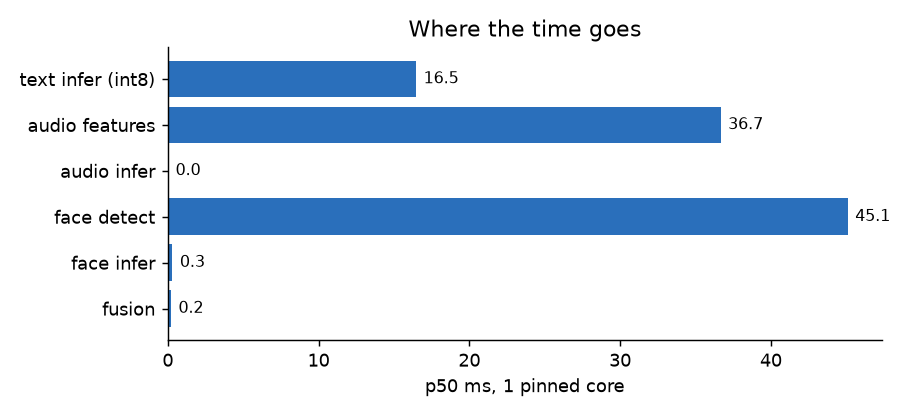
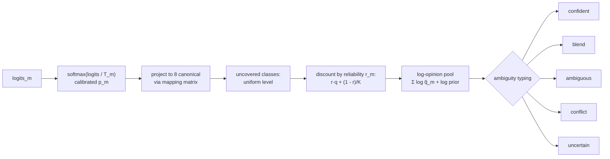
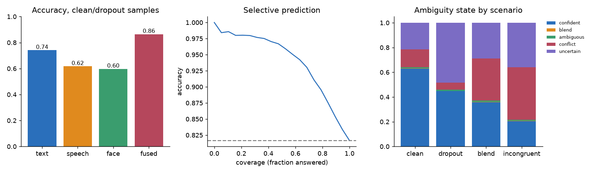
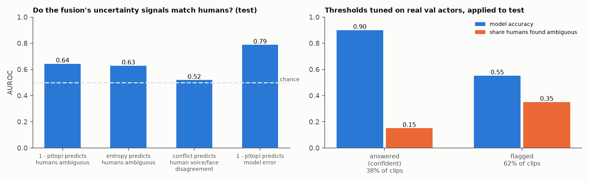
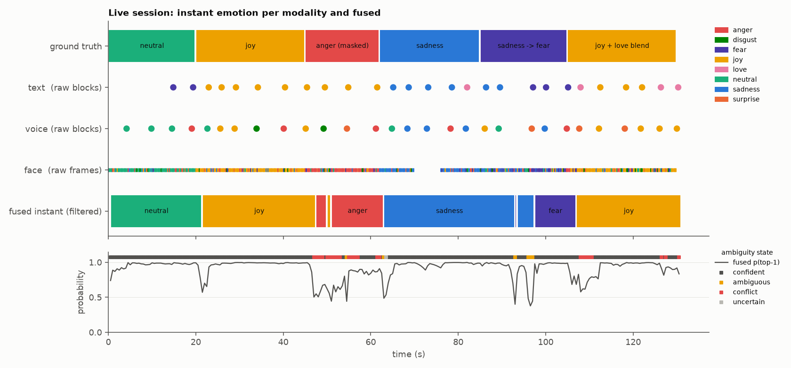

# Lightweight multimodal emotion detection for edge devices: technical documentation

This document records **what** was built, **why** each decision was made, and **how** to reproduce it. Companion documents:

| Document | Contents |
|---|---|
| [TEMPORAL_DESIGN.md](TEMPORAL_DESIGN.md) | Block segmentation, instant emotion, window mood, behavioural patterns: research basis, maths, evaluation |
| [LIVE_PIPELINE.md](LIVE_PIPELINE.md) | Running the end-to-end pipeline (demo / files / real time), input and output formats, compute budget |
| [REAL_DATA_STUDY.md](REAL_DATA_STUDY.md) | Real human-labelled data (section 4b: pretrained-encoder upgrade, fused 75.7 % vs 76.5 % for humans) (CREMA-D audio+video, MELD conversations): trained voice and face models vs human raters, fusion and ambiguity vs human judgement, temporal retuning, and what changed as a result |
| [RESULTS.md](RESULTS.md) | Every measured number and graph, generated from the result files by `python -m emotion_edge.report` |

**Convention.** A number in this document is a measurement only if a result file is named next to it. Measurements on **random weights** (valid for size and latency) or **synthetic data** (valid for checking logic) are labelled as such every time.

---

## Contents

1. [Status: verified versus pending](#1-status)
2. [Goals and constraints](#2-goals-and-constraints)
3. [System architecture](#3-system-architecture)
4. [Text track: DistilBERT on dair-ai/emotion](#4-text-track)
5. [Compression and the accuracy gate](#5-compression-and-the-accuracy-gate)
6. [Edge-device simulation](#6-edge-device-simulation)
7. [Voice-prosody track](#7-voice-prosody-track)
8. [Facial-expression track](#8-facial-expression-track)
9. [Probabilistic late fusion and ambiguity](#9-probabilistic-late-fusion-and-ambiguity)
10. [Temporal layer and live pipeline (summary)](#10-temporal-layer-and-live-pipeline)
11. [Decision log](#11-decision-log)
12. [Limitations, risks, ethics](#12-limitations-risks-ethics)
13. [Repository map](#13-repository-map)
14. [Reproduce](#14-reproduce)
15. [Glossary](#15-glossary)

---

## 1. Status

| Item | Status | Evidence |
|---|---|---|
| Text pipeline code (train → evaluate → gate → prune → export → int8 → evaluate → choose) | Runs end to end on a tiny random model and synthetic data | `make smoke` |
| **DistilBERT accuracy on dair-ai/emotion (target >= 90 %)** | **NOT MEASURED.** `huggingface.co` is blocked by this sandbox's network policy, so the dataset and pretrained weights were unavailable | Run `make real-text` or the Colab notebook |
| Quantized-model accuracy on real data | NOT MEASURED (depends on the row above) | |
| Size, memory and latency of the full-size DistilBERT architecture (fp32, int8, pruned + int8) | **Measured** on random weights | `results/edge_text_arch.json` |
| Edge scenarios: core pinning, contention, memory cap, queueing | Implemented and run | `emotion_edge/edge/bench.py` |
| Voice track | **Trained on real speech** (CREMA-D, actor-independent). The first version (prosody MLP) reached 54.0 %. **Upgraded:** a pretrained DistilHuBERT encoder + head reaches **69.4 %** (int8 69.1 %, 50.8 MB, 45 ms per clip), against 46.7 % for human voice-only raters | `results/upgrade.json` |
| Face track | **Trained on real video** (CREMA-D frames). Small CNN 56.9 %; ImageNet MobileNetV3 52.3 %; AffectNet EfficientNet-B0 53.5 %; **ensemble of CNN + AffectNet model: 58.5 %** (human face-only raters: 70.2 %). Face data, not architecture, appears to be the limit | `results/upgrade.json` |
| Late fusion with ambiguity typing | **Validated on real clips:** fused 68.4 % (+11.5 pts over best modality, ECE 0.039); answering 38 % of clips at 90 % accuracy with real-tuned thresholds. The **`conflict` signal is not validated** (AUROC 0.52 against human voice/face disagreement) | `results/real_cremad.json` |
| Temporal layer (segmentation, instant filter, Dirichlet mood, behaviour) | Synthetic benchmark plus **real data**: on real CREMA-D sessions it cuts flicker 3x but does **not** raise instant accuracy; on MELD, inertia hurts text, so text now uses carry 0; the mood P(dominant) is calibrated on real labels (ECE 0.06-0.07) | `results/real_meld.json`, `results/real_cremad.json` |
| Live pipeline (files / real time / demo) | Files mode tested end to end with real file decoding and tiny random ONNX models; real-time capture code present but **not tested** (no camera or microphone in the sandbox) | `tests/test_live_files.py` |
| Test suite | 29 tests passing | `make test` |

---

## 2. Goals and constraints

1. Fine-tune **DistilBERT** on the six-class `dair-ai/emotion` dataset (sadness, joy, love, anger, fear, surprise) and optimise **rounded** test accuracy.
2. **Gate:** quantize only if rounded test accuracy is at least 90 %, then verify the compressed model is still within an accuracy budget.
3. Report parameters, size, memory and latency in **simulated edge environments**, with graphs.
4. Build **voice-prosody** and **facial-expression** models with the same steps (train, calibrate, quantize, evaluate).
5. Combine the modalities **probabilistically, not by early fusion**, weighting each by its confidence and **flagging ambiguity** for complex or mixed emotions.
6. Read the streams **over time**:
   - decide when a block of input is complete,
   - produce an **instant emotion** and an **overall mood** over a temporal window, with a probability attached,
   - describe the **behavioural pattern**,
   - do this for text, voice and face alike.

**Constraints:** CPU-only edge targets (one or two cores, 0.5 to 2 GB RAM); privacy (all inference on device); the modalities can be missing at any time.

---

## 3. System architecture



Design principles:
1. **Each modality is independent** until the probability level: its own model, label set, calibration and quantization.
2. **Everything is a calibrated distribution**, never a bare label, so confidence, disagreement and uncertainty can be computed downstream.
3. **One shared clock and one canonical label space** (8 classes) for fusion.
4. **The cheapest thing that works** at each stage, measured before optimised.

---

## 4. Text track

### 4.1 Data

`dair-ai/emotion` (config `split`) has 16,000 training, 2,000 validation and 2,000 test English tweet-length texts with six labels (Saravia et al., 2018).

| Property | Consequence for the design |
|---|---|
| Imbalanced (per the dataset card, joy and sadness dominate; surprise is about 4 %) | Macro-F1, per-class precision and recall, and the confusion matrix are reported next to accuracy |
| Labels from hashtag distant supervision, so some noise is built in | Published DistilBERT fine-tunes report about 92-93 % (context, not measured here). The 90 % gate is reachable but leaves little headroom, which is why quantization loss is budgeted |
| Short texts | `max_len = 64`. The pipeline *measures* the truncation rate and records it in `results.json` |
| Single sentences, no conversation context | Live text is classified per utterance block, then pooled over time (TEMPORAL_DESIGN section 5) |

### 4.2 Model and training

`distilbert-base-uncased` (Sanh et al., 2019) has 6 layers, 768 hidden units and **66.96 M parameters**, of which 23.84 M (36 %) are word embeddings. It has a linear classification head on [CLS]. Training is a plain PyTorch loop (`emotion_edge/text/model.py`):

| Setting | Value | Why |
|---|---|---|
| Optimiser | AdamW, lr 3e-5 or 5e-5, weight decay 0.01 (none on bias and LayerNorm), clip 1.0 | Standard, stable transformer fine-tuning |
| Schedule | 6 % linear warm-up, then linear decay | Avoids early destabilisation of pretrained weights |
| Batching | Shuffled mega-batches, sorted by length inside, batches shuffled | Dynamic padding makes CPU training several times cheaper |
| Epochs | 3 or 4 (sweep) | Validation accuracy usually peaks in this range for this dataset size |
| Selection | **Best validation epoch**; the sweep chooses on **validation**; test is read once per run | No test-set leakage into decisions |
| Optional levers | Label smoothing; knowledge distillation from a larger fine-tuned teacher (KL at T = 2, α = 0.5; Hinton et al., 2015); multiple seeds | Used only if the plain recipe misses the gate |
| Calibration | Temperature scaling on validation logits (Guo et al., 2017); ECE reported before and after | Fusion needs probabilities that mean what they say |

`scripts/run_text.sh` runs the sweep (lr × epochs), then the final gated run, then the edge benchmark and the report.

---

## 5. Compression and the accuracy gate



| Variant | Technique | Why it exists |
|---|---|---|
| `onnx_fp32` | ONNX export (opset 17) | Baseline; proves export is lossless |
| `onnx_int8` | ONNX Runtime **dynamic** int8: int8 weights, activations quantized at run time | No calibration data needed; robust to attention and LayerNorm activation outliers; the standard CPU choice for transformers (Jacob et al., 2018) |
| `onnx_pruned_*` | Embedding rows kept only for wordpieces seen in train + validation; others map to `[UNK]` | Cuts about 12 M parameters (estimated at 15 k kept tokens). Kept tokens come from train + validation only, so test is not leaked; the accuracy effect is measured |
| `onnx_pruned_int8_emb8` | Custom `Int8Embedding`: per-row int8 table, Gather → Cast → Mul(scale) | ORT's quantizer leaves Gather tables in fp32, so this is done by hand |

### Sizes (measured, architecture-level, random weights; `scripts/arch_benchmark.py`)

| Variant | Parameters | File | Peak RSS (1 core) |
|---|---|---|---|
| fp32 | 66.96 M | 267.7 MB | 429 MB |
| int8 | 66.96 M | 138.6 MB | 279 MB |
| pruned (15 k) fp32 | ~55 M | 220.0 MB | |
| pruned (15 k) int8 + int8 embeddings | ~55 M | **56.5 MB** | **157 MB** |

The real kept-vocabulary size comes from the data and is written to `results.json` (`vocab_pruning.kept`). 15 k is an assumption used only for this size and latency measurement.

---

## 6. Edge-device simulation

### 6.1 Method

The sandbox has no ARM board, so `emotion_edge/edge/bench.py` **constrains the host CPU** to behave like a smaller device. Each scenario runs in a fresh subprocess.

| Scenario | Mechanism | Stands in for |
|---|---|---|
| `host_4core` | 4 cores, 4 threads | Upper bound |
| `sbc_2core` | `sched_setaffinity` to 2 cores, 2 threads | Small SBC or phone little cluster |
| `sbc_1core` | 1 core, 1 thread | Cheapest SBC, or the share left for NLP beside audio and video |
| `sbc_1core_contended` | 1 core plus a busy-loop process on it | Noisy neighbour or thermal throttling |
| `mem_capped_1core` | `RLIMIT_AS` = 1.1 GB | Memory-limited device (see caveat) |
| Load test | Poisson arrivals, one worker, measured service times (M/G/1 by simulation) | Several concurrent streams |

**Caveats.**
- No ARM, cache or clock emulation: absolute milliseconds are host numbers, and relative comparisons transfer better. `--slowdown` applies a ratio measured once on real hardware, and the output is labelled as a projection.
- `RLIMIT_AS` limits address space, not resident memory, and did not bind. Peak RSS is the evidence for memory fit.
- Four-thread results on short sequences are noisy (threading overhead exceeds the work). Decide on the 1-core and 2-core rows.

### 6.2 Results (architecture-level, random weights; `results/edge_text_arch.json`)



| Variant, 1 core | p50 @16 tok | p50 @32 | p50 @64 | p95 @32 |
|---|---|---|---|---|
| fp32 | 26.3 ms | 40.8 ms | 66.7 ms | 48.9 ms |
| int8 | 9.2 ms | 15.2 ms | 25.8 ms | 18.4 ms |
| pruned int8 + emb8 | 9.9 ms | 16.5 ms | 24.1 ms | 19.9 ms |

What the results show:
- **int8 is about 2.7x faster** than fp32 on one core (32 tokens).
- **Pruning and int8 embeddings save memory, not time:** peak RSS falls from 279 MB to 157 MB and the file from 139 MB to 56.5 MB, at the same latency.
- **Contention roughly doubles latency**, so budgets need that margin.
- **Load:** fp32 saturates before 20 requests/s; int8 holds p95 of 90 ms at 20/s.



### 6.3 End-to-end latency budget (one core, random weights; `results/multimodal_latency.json`)



The neural networks are **not** the bottleneck. Face detection (about 20-30 ms per frame) and prosody feature extraction (about 30 ms per 3 s segment) dominate, against under 0.6 ms for the speech and face networks. At the default rates the whole pipeline uses about 13 % of one core (LIVE_PIPELINE section 5). An earlier figure of 45 ms per frame included reloading the Haar cascade on every call, a bug found during the real-data study and fixed.

---

## 7. Voice-prosody track

| Step | What | Why |
|---|---|---|
| Features (`speech/features.py`) | 88 features:<br/>• F0 in semitones relative to 100 Hz (YIN; de Cheveigné & Kawahara, 2002), and its deltas<br/>• log-RMS and deltas<br/>• voiced ratio, jitter and shimmer proxies<br/>• onset rate (tempo proxy), pause ratio<br/>• spectral centroid, rolloff, ZCR<br/>• 13 MFCC means and standard deviations<br/>Contour features are summarised by mean, std, min, max, range, p10, p90 and slope | Affect in the voice is largely paralinguistic. This mirrors the reasoning behind compact standard sets such as eGeMAPS (Eyben et al., 2016). Semitones make pitch speaker-agnostic |
| Model | 29 k-parameter MLP; standardisation baked into the graph; feature-noise augmentation; label smoothing | Tiny, robust, int8-friendly |
| Split | **By actor** (RAVDESS: Livingstone & Russo, 2018; CREMA-D: Cao et al., 2014) | Utterance-level splits leak speaker identity and inflate accuracy |
| Export | ONNX + dynamic int8 (0.03 MB) | |
| Quality signal | SNR estimate x voiced fraction | Fusion and the temporal layer discount noisy segments |
| Verified | An octave pitch shift reads 12 ± 1.5 semitones; faster tempo gives a higher onset rate; the int8 model agrees with the torch model on > 90 % of samples | Unit tests on synthetic signals |

Why not wav2vec2 or HuBERT: 95 M+ parameters would exceed the whole text model's budget. They are a later upgrade if accuracy demands it and the hardware allows.

---

## 8. Facial-expression track

| Step | What | Why |
|---|---|---|
| Detection | OpenCV Haar cascade (Viola & Jones, 2001), largest face, 48x48 grayscale crop. OpenCV is pinned below 5.0, which removed the cascade API | CPU-cheap; a tiny face lowers reliability; no face means the modality is absent |
| Model | Mini-Xception-style CNN (Arriaga et al., 2017): depthwise-separable blocks, global average pooling, **66 k parameters** | Proven small-model recipe for FER2013 |
| Training | FER2013 (Goodfellow et al., 2013): flip, shift, brightness, label smoothing, one-cycle learning rate; PublicTest for selection, PrivateTest reported once | |
| Export | ONNX + **static** int8 (QDQ, per-channel, 200 calibration images), 0.10 MB | Convolutions need static quantization to benefit |
| Verified | Train → export → int8 round trip; int8 agrees with the torch model on > 80 % of samples (tiny synthetic task) | |

**Real result (CREMA-D video, 15 unseen actors):** 56.9 % clip accuracy against 70.2 % for human face-only raters. Joy is recognised well (recall 0.91); anger and fear poorly (0.41 and 0.39). The face model is the main accuracy bottleneck ([REAL_DATA_STUDY](REAL_DATA_STUDY.md) section 1). Expression is not inner state (Barrett et al., 2019), so fusion treats face as one noisy voice among three.

---

## 9. Probabilistic late fusion and ambiguity

### 9.1 Why late fusion

On device, the modalities arrive at different rates, drop out, come from different datasets with different label sets, and can legitimately **disagree**. Early fusion (concatenating features) needs time-aligned, complete, jointly labelled inputs, and it hides disagreement inside one classifier. Late fusion of calibrated posteriors keeps each model independent and makes disagreement measurable (Baltrušaitis, Ahuja & Morency, 2019).

### 9.2 Algorithm (`fusion/fuse.py`)



- **Canonical space:** anger, disgust, fear, joy, love, neutral, sadness, surprise. The mapping matrices are in `labels.py`; for example, happy maps to joy 0.85 + love 0.15, and calm maps to neutral.
- **Coverage:** text has no neutral class, so its opinion on neutral is set to "no information" rather than "impossible". This lets face and voice establish neutral (unit-tested).
- **Reliability:** input quality (text length, audio SNR, face size) times a per-modality base weight.
- **Pool:** a weighted product of experts (Hinton, 2002; Genest & Zidek, 1986). The output is a full posterior.

### 9.3 Ambiguity typing

| State | Trigger | Suggested action |
|---|---|---|
| `confident` | Top-1 >= `conf_p`, margin >= `margin`, experts agree | Act |
| `blend` | Top-2 close and valence/arousal-compatible (joy + love) | Report a mixed emotion |
| `ambiguous` | Top-2 close but incompatible (joy vs anger) | Gather more evidence or ask |
| `conflict` | Reliability-weighted max pairwise JSD > `conflict_jsd` | Incongruence (sarcasm, masking, sensor fault, cf. Castro et al., 2019); show each modality's reading |
| `uncertain` | Normalised entropy high or top-1 < 0.3 | Abstain |

### 9.4 Validation (simulated modality outputs; `results/fusion_sim.json`)



| Result | Value |
|---|---|
| Fused accuracy on clean and dropout samples | 0.865, against 0.741 for the best single modality |
| Accuracy when the state is `confident` | 0.961 (coverage 0.50) |
| Accuracy when flagged | 0.673 |
| Flag rate by scenario | clean 0.37, dropout 0.55, blend 0.64, incongruent 0.80 |

Thresholds were first tuned on a separate simulated set.

### 9.5 Real data (CREMA-D; [REAL_DATA_STUDY](REAL_DATA_STUDY.md) sections 2-3)

| Test actors, 1,224 clips | Value |
|---|---|
| Fused accuracy | **68.4 %**, against 54.0 % (voice) and 56.9 % (face); humans watching audio+video score 76.5 % |
| Calibration | ECE 0.039 |
| Similarity to human perception | Brier score vs human vote distributions 0.259, against 0.361 for the one-hot acted label |
| Low confidence predicts the model's own errors | AUROC 0.79 |
| Low confidence predicts human-ambiguous clips | AUROC 0.64 |
| `conflict` predicts human voice/face disagreement | AUROC **0.52, chance level: not validated** |
| Selective answering (thresholds tuned on real validation actors: `conf_p 0.7, margin 0.1, entropy 0.6, conflict_jsd 0.5`) | 37.8 % of clips answered at **90.1 %** accuracy. Flagged clips are 2.3x more often human-ambiguous |



---

## 10. Temporal layer and live pipeline

Full design: [TEMPORAL_DESIGN.md](TEMPORAL_DESIGN.md). Operations: [LIVE_PIPELINE.md](LIVE_PIPELINE.md).

| Question | Answer in this system |
|---|---|
| When is a block complete? | **Text:** sentence end (>= 3 words), pause >= 1.2 s, 40-word cap, or speaker change; short fragments merge forward. **Voice:** energy VAD, closes after a 0.4 s pause, 0.8-6 s segments, 0.5 s overlap on force-split. **Face:** 4 fps sampled frames |
| Text as a temporal feature? | Classify each utterance block (matches the training distribution), then pool **in probability space over time**. This was preferred to concatenating text or pooling embeddings (TEMPORAL_DESIGN section 5) |
| Instant emotion | Per-modality **sticky HMM filter**: time-aware stickiness exp(-Δt/dwell), scaled-likelihood updates tempered by quality. Stale modalities decay to the base rate automatically. Fused every 0.5 s with ambiguity typing |
| Overall mood | Per-modality **Dirichlet evidence** over the window (reliability × independence × recency × informativeness weights), fused by adding evidence. Outputs: mixture, 90 % credible intervals, **P(dominant)**, and a state: dominant / leaning / mixed / conflicted / transition / insufficient |
| Behavioural pattern | Valence/arousal dynamics of the filtered state: variability, MSSD instability, inertia, trend, switch rate. Tags: stable, shifting, volatile, escalating, de-escalating, flat, incongruent |

Evaluation on the synthetic scripted session (`results/temporal_eval.json`, 10 seeds), temporal layer versus static per-tick fusion:
- **Accuracy:** 0.76 → **0.96**.
- **Label switches per minute:** 43 → **1.9**.
- **Transition latency:** 3.6 s → **1.5 s**.
- **Masking flagged as `conflict`:** 0.23 → 0.25, with false alarms down from 0.05 to 0.02. Before the MELD-driven change to text inertia this was 0.70; see REAL_DATA_STUDY section 4.1.

On **real data** ([REAL_DATA_STUDY](REAL_DATA_STUDY.md) section 4):
- **CREMA-D sessions built from real clips, test actors:** instant accuracy 0.545 → 0.548 (no real gain), flicker 34.7 → 11.1 switches per minute. Parameters are insensitive (validation range 0.531-0.543), so the defaults are kept.
- **MELD conversations:** any inertia hurts per-utterance text F1, so text now uses dwell 10 s with carry 0.
- **The mood P(dominant) is calibrated on both datasets** (ECE 0.06-0.07; 0.89 accuracy in the top bin on MELD).



---

## 11. Decision log

| # | Decision | Alternatives | Reason |
|---|---|---|---|
| D1 | Plain PyTorch training loop | HF `Trainer` | Control over bucketing, best-validation checkpoint and distillation; no hidden callbacks |
| D2 | Select on validation, report test once | Select on test | Unbiased gate |
| D3 | ONNX Runtime for deployment | TFLite, ExecuTorch | One runtime for transformer, MLP and CNN; mature CPU kernels on x86 and ARM |
| D4 | Dynamic int8 for transformer and MLP; static QDQ for CNN | Static everywhere | Dynamic needs no calibration and is safe for attention; convolutions need static |
| D5 | Custom int8 embedding table | Leave fp32 | 36 % of parameters, untouched by ORT |
| D6 | Vocabulary pruning from train + validation tokens | Full vocabulary | Smaller file and RSS; measured, not assumed |
| D7 | Accept a quantized variant only if the drop is <= 1.0 pt | Accept any | Keeps the 90 % gate meaningful after compression |
| D8 | Prosody statistics + MLP | wav2vec2 / HuBERT | Size and latency; affect is paralinguistic |
| D9 | Actor-independent speech splits | Random splits | Prevents speaker leakage |
| D10 | Late fusion by reliability-discounted log-opinion pool | Early fusion, Dempster-Shafer, learned stacking | Handles dropout and mismatched labels, keeps disagreement visible, needs no joint data |
| D11 | 8-class canonical space with coverage masks | Label intersection | Keeps neutral and disgust without letting text veto them |
| D12 | Typed ambiguity states | Single entropy threshold | Blend, conflict and uncertainty need different responses |
| D13 | Macro-F1, confusion matrix and ECE next to accuracy | Accuracy only | Imbalance; trustworthy probabilities |
| D14 | Never report synthetic or random-weight runs as accuracy | | Integrity; every such file carries `"synthetic": true` |
| D15 | Per-utterance text classification, then temporal pooling in probability space | Concatenate window text; pool embeddings | Matches the training distribution; streaming; uncertainty per block (TEMPORAL_DESIGN section 5) |
| D16 | Sticky HMM filter for the instant emotion | EMA, majority vote, learned HMM, LSTM | Time-aware, quality-aware, staleness built in, one parameter, no training data needed |
| D17 | Dirichlet evidence for the window mood | Average probabilities, majority vote | Gives P(dominant), credible intervals and n_eff; handles correlated frames via τ_c; transitions detectable |
| D18 | Mood evidence from per-block distributions, not filtered beliefs | Pool filtered beliefs | Filtered beliefs are autocorrelated and would count evidence twice |
| D19 | Cross-modal mood fusion by adding evidence | Pool modality means | Exact Bayesian update under independence; evidence-rich modalities weigh more automatically |
| D20 | A `transition` mood state (half-window comparison) | Treat as mixed or conflicted | A first evaluation showed sequential emotions being mislabelled as simultaneous |
| D21 | Behaviour metrics on valence/arousal, tags with explicit thresholds | Learned pattern classifier | Matches the affect-dynamics literature; transparent; no labelled data available |
| D22 | Offline files replayed through the live code path | Separate batch path | One code path to test and tune; deterministic |
| D23 | Face at 4 fps with Haar detection | Every frame; neural detector | Detection dominates cost; 4 fps still sees every expression |
| D24 | Validate on CREMA-D and MELD (official GitHub sources) | Wait for blocked hosts | Real human labels, including per-modality rater votes, were reachable; the actor-independent protocol avoids leakage |
| D25 | Split filter persistence (dwell) from inertia (carry); text carry 0 | One time constant | MELD: inertia lowers per-utterance F1 while persistence alone is free |
| D26 | Window incongruence = P(opposite valence) between modality leaders | V/A distance | The distance rule counted neutral as incompatible, causing false alarms |
| D27 | Keep default temporal parameters rather than the values retuned on CREMA-D validation | Adopt the retuned values | Accuracy was flat across the sweep and the retuned values were not better on test; session episodes are constructed |
| D28 | Recommend thresholds tuned on real validation actors | Simulation-tuned | 90.1 % vs 88.6 % accuracy on answered test clips; flagged clips align better with human ambiguity |

---

## 12. Limitations, risks, ethics

- **The headline accuracy is pending.** Everything else is ready for it.
- **Real validation is partial.** It covers CREMA-D (acted, single-sentence clips; sessions assembled from them) and MELD text. The `conflict` / `incongruent` signals are **not validated** (AUROC 0.52). In-domain recordings with annotations are still needed ([REAL_DATA_STUDY](REAL_DATA_STUDY.md) section 6).
- **Real-time gap.** Instant accuracy on real sessions (0.55) is below clip-level fused accuracy (0.68), because the voice reading arrives at the end of each sentence and the face has seen only part of it at each tick.
- **Per-person variation.** The face model fails on some actors' anger and fear. Per-user calibration is a likely improvement.
- **Domain shift.** dair-ai texts are tweets with hashtag-derived labels; conversation transcripts differ. FER2013 and acted speech corpora differ from spontaneous behaviour.
- **Expressed affect is not inner state** (Barrett et al., 2019). Outputs are probabilistic descriptions of expression; the `conflict`, `blend` and `uncertain` states exist to avoid false certainty.
- **Behavioural tags are heuristics** over seconds to minutes, not clinical constructs.
- **Fairness.** The training corpora are demographically narrow. Measure per-group error before any deployment.
- **Consent and privacy.** Continuous tracking needs informed consent. Inference is on device and only derived probabilities need to leave it.
- **Edge numbers are host-based proxies** (section 6.1).
- **Real-time capture** (camera and microphone threads) is implemented but untested here.

---

## 13. Repository map

```
emotion_edge/
  labels.py              label sets, canonical space, mapping matrices, valence/arousal placement
  common/                ONNX export + quantization helpers; metrics, ECE, temperature scaling
  text/                  data (Hub / offline / synthetic), model (+ vocab pruning, Int8Embedding), pipeline CLI
  speech/                prosody features + audio quality; MLP training, actor split, export
  vision/                mini-Xception; Haar detection + crop; training, static int8 export
  fusion/                fuse.py (pool + ambiguity), simulate.py (synthetic validation, threshold tuning)
  temporal/              segment.py, tracker.py (filter, Dirichlet mood, behaviour), session.py, evaluate.py, viz.py
  live/                  sources.py (files, real time), predictors.py (ONNX wrappers), pipeline.py, scenario.py
  edge/bench.py          edge scenarios + queueing simulation
  report.py              docs/RESULTS.md + figures
scripts/                 run_text.sh, live.py, arch_benchmark.py, run_edge_bench.py, multimodal_latency.py, run_fusion_sim.py
tests/                   fusion, speech/vision round trips, temporal, live files integration (27 tests)
notebooks/               colab_text_run.ipynb (GPU run of the text track)
docs/                    this file, TEMPORAL_DESIGN.md, LIVE_PIPELINE.md, RESULTS.md, figures/
```

---

## 14. Reproduce

```bash
pip install -r requirements.txt
make test                          # 27 tests, no network
make smoke                         # text pipeline on synthetic data (code path only)
make arch edge latency             # architecture-level size and edge latency (random weights)
make fusion                        # fusion validation (simulated outputs)
python scripts/live.py demo        # live pipeline demo + temporal figures + 10-seed evaluation
make report                        # regenerate docs/RESULTS.md

make real-text                     # REAL text run: needs huggingface.co, or DATA_DIR + MODEL
# speech / face training: scripts/run_speech_face.md
```

Full order once data is reachable:
1. `make real-text`
2. Train speech and face.
3. Re-tune fusion thresholds and temporal parameters on the real validation logits and recordings.
4. `python scripts/live.py files ...` on annotated sessions.
5. `make report`.

---

## 15. Glossary

| Term | Meaning |
|---|---|
| Block | One unit sent to a model: a text utterance, a voiced audio segment, a sampled face frame |
| Calibration (temperature) | Rescaling logits so that predicted probabilities match observed accuracy |
| Canonical space | The shared 8-emotion label set used for fusion |
| Coverage | Which canonical classes a modality can express |
| Dwell | How long an instant reading stays relevant without new evidence (filter time constant) |
| ECE | Expected calibration error |
| Informativeness | 1 minus normalised entropy: 0 for "knows nothing", 1 for certain |
| JSD | Jensen-Shannon divergence, a bounded measure of disagreement between two distributions |
| MSSD | Mean squared successive difference, the instability of a time series |
| n_eff | Effective number of independent, informative observations behind a mood estimate |
| P(dominant) | Probability, under the Dirichlet posterior, that the reported mood is the largest share |
| τ_c | Correlation time: one unit of mood evidence per τ_c seconds of observation |

---

## References

Arriaga, O., Valdenegro-Toro, M., & Plöger, P. (2017). Real-time convolutional neural networks for emotion and gender classification. arXiv:1710.07557 ·
Baltrušaitis, T., Ahuja, C., & Morency, L.-P. (2019). Multimodal machine learning: a survey and taxonomy. *IEEE TPAMI* ·
Barrett, L. F., et al. (2019). Emotional expressions reconsidered. *Psychological Science in the Public Interest* ·
Cao, H., et al. (2014). CREMA-D: crowd-sourced emotional multimodal actors dataset. *IEEE Trans. Affective Computing* ·
Castro, S., et al. (2019). Towards multimodal sarcasm detection. *ACL* ·
de Cheveigné, A., & Kawahara, H. (2002). YIN, a fundamental frequency estimator for speech and music. *JASA* ·
Eyben, F., et al. (2016). The Geneva Minimalistic Acoustic Parameter Set (GeMAPS). *IEEE Trans. Affective Computing* ·
Genest, C., & Zidek, J. V. (1986). Combining probability distributions. *Statistical Science* ·
Goodfellow, I., et al. (2013). Challenges in representation learning: a report on three machine learning contests. *ICONIP* ·
Guo, C., et al. (2017). On calibration of modern neural networks. *ICML* ·
Hinton, G. (2002). Training products of experts by minimizing contrastive divergence. *Neural Computation* ·
Hinton, G., Vinyals, O., & Dean, J. (2015). Distilling the knowledge in a neural network. arXiv:1503.02531 ·
Jacob, B., et al. (2018). Quantization and training of neural networks for efficient integer-arithmetic-only inference. *CVPR* ·
Livingstone, S. R., & Russo, F. A. (2018). The Ryerson Audio-Visual Database of Emotional Speech and Song (RAVDESS). *PLoS ONE* ·
Sanh, V., et al. (2019). DistilBERT, a distilled version of BERT. arXiv:1910.01108 ·
Saravia, E., et al. (2018). CARER: contextualized affect representations for emotion recognition. *EMNLP* ·
Viola, P., & Jones, M. (2001). Rapid object detection using a boosted cascade of simple features. *CVPR*.
Temporal-layer references are listed in [TEMPORAL_DESIGN.md](TEMPORAL_DESIGN.md#14-references).
