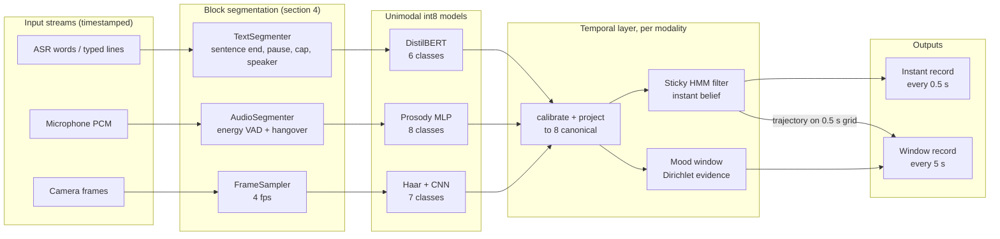
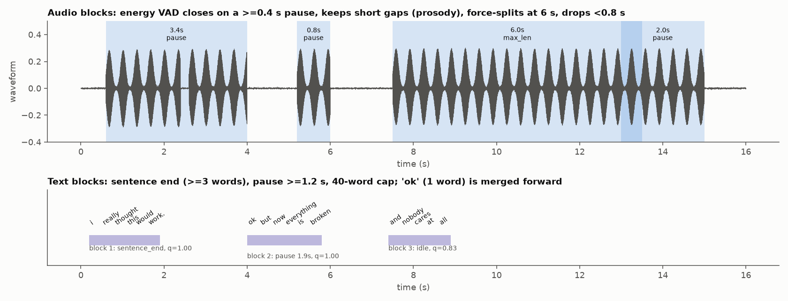
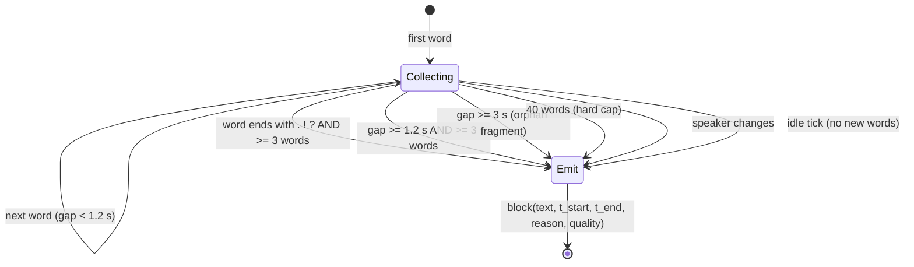
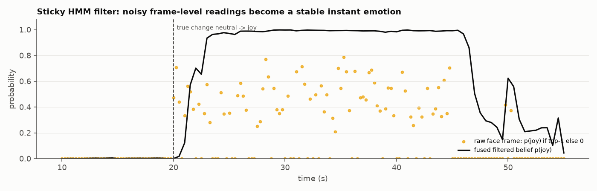
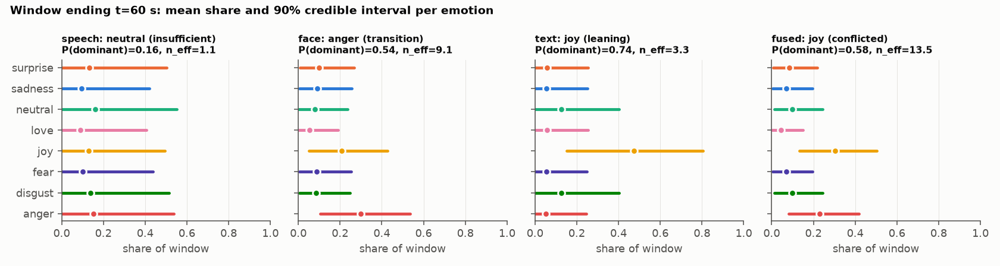
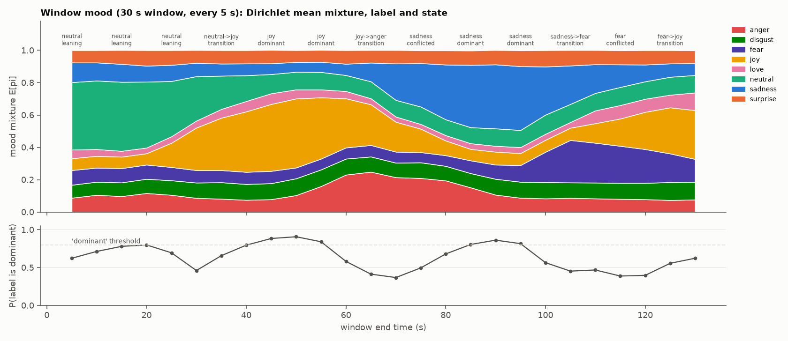
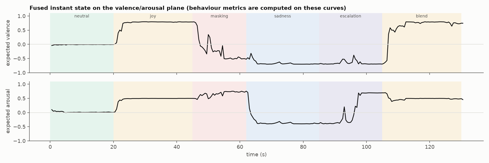
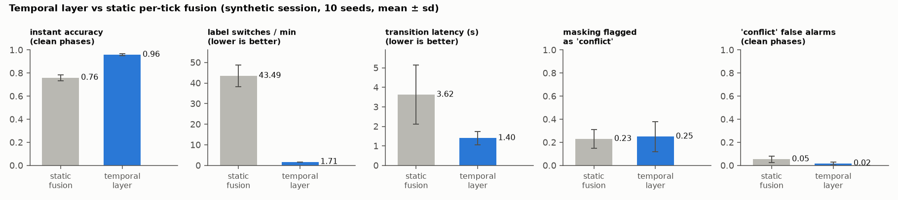

# Temporal design: from moments to mood

This document explains how the system turns a **stream** of text, voice and face data into three outputs:

1. an **instant emotion**: what the person is expressing right now,
2. a **window mood**: the overall affective state over the last *W* seconds, with a probability that the label is right,
3. a **behavioural pattern**: how the state is moving over the window (stable, shifting, volatile, escalating, de-escalating, flat, incongruent).

It covers what each part does, why it was chosen (with the research it rests on), how it is computed, and how it was checked. The code lives in `emotion_edge/temporal/` and `emotion_edge/live/`. Every number quoted here comes from `results/temporal_eval.json`, which was produced on a **synthetic, scripted session**, because no real multimodal recordings were available in this environment. Those numbers show that the logic works. They are not a measure of real-world accuracy.

---

## Contents

1. [The problem](#1-the-problem)
2. [Research basis: emotion versus mood, and affect dynamics](#2-research-basis)
3. [Architecture](#3-architecture)
4. [Block segmentation: when to stop and treat a block as one](#4-block-segmentation)
5. [The text strategy: classify blocks, then pool probabilistically](#5-the-text-strategy)
6. [Instant emotion: the sticky HMM filter](#6-instant-emotion-sticky-hmm-filter)
7. [Window mood: Dirichlet evidence accumulation](#7-window-mood-dirichlet-evidence-accumulation)
8. [Behavioural pattern: affect dynamics](#8-behavioural-pattern)
9. [Cross-modal fusion over time](#9-cross-modal-fusion-over-time)
10. [Parameter choices](#10-parameter-choices)
11. [Evaluation](#11-evaluation)
12. [Alternatives considered](#12-alternatives-considered)
13. [Limitations and next steps](#13-limitations-and-next-steps)
14. [References](#14-references)

---

## 1. The problem

The unimodal models answer one question about one bounded input: "what emotion is in this sentence, voice segment or face crop?" A live system has to answer different questions:

- **What is the input unit?** A stream has no natural "one input". A boundary has to be chosen per modality.
- **What is happening now?** Frame-level face predictions are noisy. A static per-frame label switches about 43 times a minute even when the true emotion does not change (section 11).
- **What is the overall state?** One frame says little about how someone feels over half a minute. A summary over time needs an explicit notion of evidence and uncertainty.
- **How is it changing?** Two people with the same average mood can differ completely: one steady, one swinging between extremes. The dynamics are informative in their own right.
- **Do the channels agree over time?** A momentary mismatch between face and words is noise. A mismatch sustained for 15 seconds is a pattern, for example sarcasm or masking.

---

## 2. Research basis

### 2.1 Emotion and mood work on different time scales

Affect research separates **emotions** from **moods**:
- **Emotions** are short, object-directed responses with a clear expression, typically lasting seconds to minutes.
- **Moods** are longer, more diffuse states with weaker expression, lasting minutes to hours (Beedie, Terry & Lane, 2005).
- Facial expressions of basic emotions are brief, usually between 0.5 and 4 seconds (Ekman, 1992).
- Self-reported emotion episodes vary widely in length, and sadness tends to last longest (Verduyn & Lavrijsen, 2015).

This gives the system two time scales:

| Output | Time scale | Model |
|---|---|---|
| Instant emotion | Seconds (dwell 3 to 10 s depending on modality) | Sticky HMM filter (section 6) |
| Window mood | Tens of seconds (default 30 s, configurable to minutes) | Dirichlet evidence accumulation (section 7) |

**Terminology caveat.** A 30-second window is far shorter than a clinical or psychological "mood". In this system, "mood" means *the dominant affective state expressed over the window*, nothing more.

### 2.2 Dynamics carry information

Affect-dynamics research shows that how affect moves over time is informative independently of its average:
- **Variability:** the standard deviation of affect.
- **Instability:** the mean squared successive difference (MSSD), which captures moment-to-moment jumps. Ebner-Priemer et al. (2009) argue that MSSD captures instability better than variance does.
- **Inertia:** the lag-1 autocorrelation, meaning how strongly the current state carries over to the next. High emotional inertia has been linked to maladjustment (Kuppens, Allen & Sheeber, 2010).

A meta-analysis found that higher variability, instability and inertia of affect are associated with lower psychological well-being (Houben, Van Den Noortgate & Kuppens, 2015).

These metrics are computed (section 8) on the **valence and arousal** of the filtered state, using a circumplex placement of the eight emotions (Russell, 1980). This puts dynamics on a continuous scale where "joy → love" is a small move and "joy → anger" is a large one.

**Important.** These are descriptive measurements of *expressed* affect over seconds to minutes. They are not diagnoses, and the literature above links them to well-being over much longer periods (days to weeks of self-report). Expressions are also not a direct readout of inner feeling (Barrett et al., 2019). This system reports patterns, not mental states.

### 2.3 Why probability distributions throughout

Every stage keeps a full probability distribution, never only a label:
- **Calibrated unimodal outputs** (temperature scaling; Guo et al., 2017) make probabilities from different models comparable.
- **Product-of-experts / log-opinion pooling** (Hinton, 2002; Genest & Zidek, 1986) combines independent sources, and a disagreement between sources stays measurable.
- **The hybrid HMM trick** (Bourlard & Morgan, 1994) turns a classifier's posterior into an emission likelihood: posterior divided by prior.
- **Dirichlet distributions** over class proportions provide counts, uncertainty and "probability that the label is right" in one object. A related use of Dirichlet evidence is evidential deep learning (Sensoy et al., 2018).

---

## 3. Architecture



Each modality keeps its own filter and mood window. The two meet in two places:
- **Instant fusion**, on every tick: the filtered beliefs are pooled and the ambiguity state is typed.
- **Window fusion**, on every hop: mood evidence is pooled and the cross-modal agreement over the window is measured.

---

## 4. Block segmentation

> *"When do we stop collecting and treat what we have as one block for analysis?"*

A good block is:
- **long enough** to carry affect,
- **short enough** not to average across an emotional change,
- **closed at a natural boundary** whenever one exists, with a hard cap otherwise.



### 4.1 Text (`TextSegmenter`)

Input is either word-level ASR output with timestamps, or typed lines.



| Rule | Value | Why |
|---|---|---|
| Sentence end closes the block | needs >= 3 words | A sentence is the unit DistilBERT was trained on (one tweet-like sentence). Fragments like "Ok." carry almost no affect, so they are merged into the next block. |
| Pause closes the block | >= 1.2 s | Within a turn, pauses longer than about a second usually mark a new utterance. Shorter gaps are hesitation. |
| Orphan fragment | 3 s | A short fragment is only emitted on its own if nothing follows. |
| Hard cap | 40 words | WordPiece expands words to about 1.3 tokens on average, and the model's window is 64 tokens. Splitting at 40 words keeps every block inside the model's input. |
| Speaker change | always | Different speakers' emotions must not be mixed. |
| Quality | min(1, words / 6) | Reliability rises with length. A two-word block gets a third of the weight of a full sentence. |

### 4.2 Voice (`AudioSegmenter`)

An energy-based voice activity detector on 20 ms frames:

1. **Noise floor:** the 10th percentile of the last 10 s of frame energies. It adapts to the room. No decisions are made in the first 200 ms, until the floor has been measured; this fixed a false onset on background noise found during testing.
2. **Speech frame:** energy above floor + 9 dB, and above -50 dBFS.
3. **Hangover:** a segment ends only after **0.4 s** of continuous non-speech. Shorter gaps (plosives, breaths, brief hesitations) stay inside the segment, because pause structure is part of prosody.
4. **Hard cap:** **6 s**. Longer speech is force-split with **0.5 s overlap**, so a change in tone inside a long turn is not averaged away.
5. **Rejection:** segments shorter than **0.8 s** are dropped. Pitch and energy statistics over fewer than about 40 voiced frames are unreliable.
6. **Quality:** SNR estimate x voiced fraction (`speech.features.audio_quality`).

Why energy VAD and not a neural VAD: it costs effectively nothing on one core and has no dependencies. A neural VAD can be swapped in through the same `push` / `flush` interface where background speech is a problem.

### 4.3 Face (`FrameSampler`)

- Camera frames are down-sampled to **4 fps** on a fixed time grid (drift-free; also fixed during testing).
- Each sampled frame is one block: Haar detection, crop, CNN.
- Detection costs about 20-30 ms on one core, so 4 fps uses about 8-12 % of a core. Expressions last 0.5 to 4 s, so 4 fps still samples each one at least twice.
- Frames without a detected face produce **no** observation. The face modality is then simply absent and its filter decays (section 6.3).
- Face blocks are not grouped into larger blocks. The temporal models below handle the correlation between consecutive frames explicitly.

---

## 5. The text strategy

> *Should text be analysed as individual sentences, or as one temporal feature over the window?*

| Option | How | Pros | Cons | Decision |
|---|---|---|---|---|
| **A. Per-block classification + probabilistic temporal pooling** | Classify each utterance block; the sticky filter tracks the instant state and Dirichlet evidence summarises the window | Matches the training distribution (single sentences); each block keeps its own confidence; recency, uncertainty and change detection come for free; streaming, constant cost per block | Cross-sentence context ("I thought it would be fun. It wasn't.") is only captured through the temporal model | **Chosen** |
| B. Concatenate the window's text, classify once | Join all utterances in the last W seconds into one string | Model sees the context | Strong shift from the training distribution (dair-ai is single sentences); truncated at 64 tokens; recent text gets no extra weight; cost grows with the window; no per-utterance uncertainty | Rejected |
| C. Pool embeddings, then classify | Mean-pool each utterance's [CLS] embedding over the window, then a classifier | One vector per window | Needs a classifier trained on pooled embeddings, and dair-ai has no conversation-level labels; averaging embeddings blurs opposite emotions into a meaningless middle | Rejected (no training data) |
| D. Context-pair classification | Classify (previous block, current block) pairs | Local context | Needs paired training data | Future work, if conversation data with labels is available |

**Why A wins.** Treating text as a temporal signal happens **after** classification, in probability space, not in embedding space. That gives the same machinery for all three modalities: text utterances, voice segments and face frames all become timestamped probability distributions, and the temporal layer does not care which model produced them.

---

## 6. Instant emotion: sticky HMM filter

### 6.1 Model

The hidden state is the true emotion *y_t* in the 8-class canonical space. Emotions persist, so between two observations the state mostly stays the same. If it changes, it falls back toward a base distribution π (uniform by default).

**Predict** (time update, with Δt = time since the last update):

```
s(Δt)  = exp(-Δt / dwell)                    # stickiness decays with elapsed time
b_t|t-Δt = s(Δt) · b_{t-Δt} + (1 - s(Δt)) · π
```

**Persistence versus inertia (added after the real-data study).** The update below first mixes the predicted belief with the base rate by a factor *carry* in [0, 1]:

```
prior = carry · b_t|t-Δt + (1 - carry) · π
```

- *dwell* controls **persistence**: how long a reading stays relevant when nothing new arrives.
- *carry* controls **inertia**: how much the accumulated state biases the interpretation of a *new* observation.

Face frames are strongly autocorrelated, so face uses carry 1, the standard HMM. In real conversations (MELD) a speaker's next utterance keeps the same emotion only 44 % of the time, and any carry > 0 lowered per-utterance F1, so text uses **carry 0 with dwell 10 s**: every utterance is judged on its own and then stays available for cross-modal comparison. See [REAL_DATA_STUDY](REAL_DATA_STUDY.md) section 4.1.

**Update** (when a block arrives with calibrated canonical distribution *q* and reliability *r*):

```
likelihood(y) ∝ (q(y) / π(y)) ^ r            # hybrid HMM: posterior / prior = scaled likelihood
b_t ∝ b_t|t-Δt · likelihood
```

- *q* comes from the unimodal model after temperature scaling and projection to the canonical space. Classes the modality cannot express get the uniform level, so they are neither favoured nor ruled out.
- *r* in [0, 1] tempers the likelihood. At *r* = 0 the block is ignored; at *r* = 1 it counts fully. *r* is the block's quality (text length, audio SNR, face size) times the modality's base weight.

### 6.2 Why this model

- **Time-aware.** The transition depends on the actual gap Δt. This matters because the three modalities arrive irregularly: face every 0.25 s, voice every few seconds, text whenever someone speaks.
- **Outlier-robust.** One wrong frame cannot flip a well-supported state (unit-tested). A real change still wins after a few consistent observations: median transition latency is 1.4 s on the synthetic session and about 1.1 s on real CREMA-D sessions.
- **One parameter per modality** (dwell), interpretable as "how long a reading stays relevant".
- **Constant cost:** an 8-element vector update per block (microseconds).

### 6.3 Staleness falls out of the model

Between observations only the predict step runs, so a modality that stops producing data (person looks away, stops talking) **decays smoothly back to π**. Its *informativeness*, 1 minus normalised entropy, drops toward 0, and instant fusion weights each modality by that informativeness. A stale modality therefore loses its vote without any special-case "timeout" logic.



*Face frames during neutral → joy (synthetic). Raw per-frame readings scatter between 0.2 and 0.8 and often name another emotion. The fused filtered belief rises within about 2 s of the change and then stays stable.*

---

## 7. Window mood: Dirichlet evidence accumulation

### 7.1 Model

The question is: *what mixture of emotions did this person express over the last W seconds, and how sure are we?* The mixture is modelled as a probability vector π_W with a Dirichlet distribution:

```
π_W ~ Dirichlet(α),   α = α0 + Σ_i w_i · q_i
w_i = r_i · min(1, dur_i / τ_c) · 0.5^(age_i / half_life) · min(1, 2 · (1 - H_norm(q_i)))
          └reliability┘ └independence┘   └──recency──┘           └──informativeness──┘
```

| Term | Meaning | Why |
|---|---|---|
| α0 = 0.25 per class | Weak symmetric prior (2 pseudo-observations in total) | Keeps estimates sane with little evidence without dominating real evidence |
| q_i | Calibrated canonical distribution of block *i* (not the filtered belief) | Filtered beliefs are autocorrelated by construction, and feeding them in would count evidence twice |
| r_i | Block reliability | Same as the filter |
| min(1, dur_i / τ_c) | Independence weight | Consecutive face frames are highly correlated: 40 frames of the same expression in 10 s are not 40 votes. With τ_c = 1 s, 10 s of face data is about 10 units of evidence whatever the frame rate (unit-tested: 10 fps and 1 fps give the same n_eff to within 0.6) |
| 0.5^(age / half_life) | Recency | The mood leans toward the recent part of the window. Default half-life = window length, which is mild |
| min(1, 2(1 - H_norm)) | Informativeness | Flat "don't know" outputs should not vote. This matters most for text, whose 6-class model has to spread its mass when the true state (for example neutral) is outside its label set |

`n_eff = Σ w_i` is the effective number of informative, independent observations behind the estimate.

### 7.2 What the Dirichlet gives us

- **Mixture:** E[π_W] = α / Σα, the expected share of each emotion.
- **90 % credible interval per emotion:** exact, from the Beta marginal Beta(α_k, Σα - α_k).
- **P(dominant):** the probability that the reported mood really has the largest share. It is computed by drawing 2,000 samples from Dirichlet(α) and counting how often each emotion is largest. This is the probability attached to the mood label: it rises with more and more consistent evidence, and stays low when two emotions compete.



*Window ending at 60 s, during the masking phase. Text leans toward joy with wide intervals (3.3 units of evidence). Voice has too little evidence to say anything. Face is in transition from joy to anger. The fused mood is joy, but marked conflicted, with P(dominant) = 0.58.*

### 7.3 Mood state

Rules are applied in this order:

| State | Rule | Reading |
|---|---|---|
| `insufficient` | n_eff < 1.5 | Not enough informative evidence: report nothing |
| `transition` | The older and newer halves of the window each have a clear leader (>= 1.5x the runner-up), and the leaders differ | The window straddles a change; report "from → to" |
| `dominant` | P(dominant) >= 0.8 | One clear mood |
| `mixed` | Runner-up share >= 0.6x the top share, and the two are valence/arousal-compatible (for example joy and love) | A genuine blend |
| `conflicted` | Same, but incompatible (for example joy and anger) | Competing or masked states; inspect the modalities |
| `leaning` | Otherwise | A leader exists but the evidence is not yet decisive |

The `transition` rule was added after the first evaluation pass. Without it, windows that straddle a change were reported as `conflicted`, which is wrong: two emotions *in sequence* are not two emotions *at once*.



---

## 8. Behavioural pattern

The filtered fused belief is sampled every 0.5 s and mapped to expected valence and arousal (`b_t · VA`). Over the window, the following metrics are computed:

| Metric | Definition | What it captures |
|---|---|---|
| valence_mean, arousal_mean | Mean | Overall tone |
| valence_sd, arousal_sd | Standard deviation | Variability |
| valence_mssd, arousal_mssd | mean((x_{t+1} - x_t)^2) | Instability: sudden jumps (Ebner-Priemer et al., 2009) |
| valence_inertia, arousal_inertia | Lag-1 autocorrelation | Carry-over (Kuppens et al., 2010) |
| *_trend_per_min | OLS slope per minute | Direction of change |
| switch_per_min | Changes of the confident (> 0.5) top label per minute | Lability; near-ties are ignored (hysteresis) |
| dominant, dominant_share | Most frequent top label and its share of ticks | Stability of the instant state |
| mean_informativeness | Mean of 1 - normalised entropy | Expressivity; low values mean flat or unreadable |

**Tags** are descriptive heuristics with explicit, configurable thresholds:

| Tag | Rule (defaults) |
|---|---|
| `insufficient` | Fewer than 8 grid points |
| `flat` | mean_informativeness < 0.15 |
| `volatile` | switch_per_min > 4, or MSSD > 0.08 |
| `escalating` | Arousal trend > +0.3/min, valence trend < +0.3/min, window >= 15 s |
| `de-escalating` | Arousal trend < -0.3/min, window >= 15 s |
| `stable` / `shifting` | If nothing else applies: dominant_share >= 0.7 means stable, otherwise shifting |
| `incongruent` | >= 30 % of the window's ticks were cross-modal `conflict`, or cross-modal mood JSD >= 0.15 |

Two notes on the tag rules:
- The 15 s minimum for trend tags removes a start-up artefact found in testing: the filter starting from π was being read as "de-escalating".
- An earlier `escalating` rule required valence to be non-increasing. Noise of +0.04/min blocked it, so the rule is now "valence not rising meaningfully".



---

## 9. Cross-modal fusion over time

### 9.1 Instant (every tick)

For each modality seen so far, the filter is advanced to the tick time and its belief is divided by π (removing the prior so it is not counted three times). The results are pooled with `fuse_canonical`: a log-opinion pool plus ambiguity typing (`confident / blend / ambiguous / conflict / uncertain`, see TECHNICAL_DOCUMENTATION section 6). The reliability used for the conflict test is each filter's **informativeness**, so a stale or flat modality cannot trigger a false conflict.

### 9.2 Window (every hop)

**Evidence is added across modalities:**

```
α_fused = α0 + Σ_m λ_m · Σ_{i in m} w_i q_i
```

If the modalities are independent noisy views of the same underlying mixture, adding pseudo-counts is exactly the Bayesian update. Modalities with more informative evidence dominate automatically: face at 4 fps contributes about 9 units per 30 s, text about 3. λ_m is the modality base weight (default 1).

The fused mood carries two disagreement signals:
- `cross_modal_jsd`: the largest pairwise Jensen-Shannon divergence between modality mood means, weighted by evidence.
- `conflict_share`: the fraction of instant ticks in the window that were `conflict`.

A third signal is added as `p_incongruent`: under each modality's Dirichlet posterior (recency-weighted, half-life = window/4), the probability that two modalities' leading emotions have **opposite valence** (each |v| >= 0.3), for example words saying joy while the face says anger. Neutral never counts, because one channel being less expressive is not incongruence. An earlier rule based on valence/arousal distance treated neutral as "incompatible" and produced a 0.61 false-alarm rate on the synthetic benchmark, so it was replaced.

The `incongruent` tag is added when `conflict_share` >= 0.3 or `p_incongruent` >= 0.4. That separates a **sustained** incongruence (masking, sarcasm) from a momentary glitch. **Caveat:** on real CREMA-D clips the instant `conflict` signal did not predict human voice/face disagreement (AUROC 0.52), so both signals are currently **unvalidated** ([REAL_DATA_STUDY](REAL_DATA_STUDY.md) section 3).

---

## 10. Parameter choices

| Parameter | Text | Voice | Face | Rationale |
|---|---|---|---|---|
| dwell (persistence) | 10 s | 6 s | 3 s | Matches how often each modality refreshes. A text reading must survive the gap to the next utterance (about 4 to 8 s); face refreshes 4 times per second. On real CREMA-D sessions, accuracy was flat across face dwell 1-8 s and voice dwell 2-10 s, so the defaults are kept |
| carry (inertia) | **0** | 1 | 1 | Text: real conversations show little utterance-to-utterance inertia (MELD); any carry > 0 hurt. Face and voice: consecutive observations are autocorrelated |
| τ_c (independence) | 1 (one block = one unit) | 2 s | 1 s | Face expressions change on second scales (Ekman, 1992); a voice segment of up to 2 s counts as at most one unit |
| window | 30 s | | | Long enough to collect about 10 to 20 informative units across modalities, short enough to follow a conversation. Use 60 to 300 s for slower "mood" questions |
| hop | 5 s | | | Updates the mood often enough to drive a UI without recomputing every tick |
| tick | 0.5 s | | | Faster than the shortest expression; fusion costs about 0.2 ms |
| α0 | 0.25 / class | | | Weak prior |
| min_evidence | 1.5 | | | About 2 confident sentences or 1.5 s of clear face |

All of these are in `SessionConfig` / `temporal.session.DEFAULTS` and can be overridden per deployment. With real data they should be **tuned on validation recordings**: dwell and τ_c by maximising instant accuracy and minimising flicker; window by the use case.

---

## 11. Evaluation

**Setup.** A scripted 130 s session (`emotion_edge/live/scenario.py`) with six phases:

| Phase | Time (s) | Truth | What the modalities see |
|---|---|---|---|
| neutral | 0-20 | neutral | All neutral (text cannot express neutral, so it is uninformative) |
| joy | 20-45 | joy | All joy |
| masking | 45-62 | anger | Text joy; voice and face anger |
| sadness | 62-85 | sadness | All sadness; face missing 70-76 s |
| escalation | 85-105 | sadness → fear | Rising intensity and fear share |
| blend | 105-130 | joy + love | Each block randomly joy or love |

Model outputs are simulated per block with the same noise model as the fusion study: text is strong but blind to neutral and disgust, voice and face are weaker. The comparison is against **static fusion**: at every tick, fuse the latest block of each modality from the last 2 s, with no temporal model. Ten seeds were run.



| Metric | Static fusion | Temporal layer |
|---|---|---|
| Instant accuracy, clean phases | 0.760 ± 0.026 | **0.959 ± 0.010** |
| Label switches per minute (truth ≈ 0) | 43.5 ± 5.3 | **1.7 ± 0.0** |
| Transition latency | 3.6 ± 1.5 s | **1.4 ± 0.3 s** |
| Masking phase flagged as `conflict` | 0.23 ± 0.08 | 0.25 ± 0.13 (0.70 before text carry was set to 0) |
| `conflict` false alarms, clean phases | 0.05 ± 0.03 | **0.02 ± 0.01** |
| Blend phase labelled joy or love | 0.69 ± 0.04 | **0.90 ± 0.04** |

Window-level results:
- **Mood accuracy:** 1.00 on windows with a clear majority emotion. A naive majority vote of raw blocks also scores 1.00 there, so on easy windows the Dirichlet model **does not beat** a vote.
- **Where the Dirichlet adds value:** it reports *how sure* it is (P(dominant), credible intervals), detects **transitions** (correct target in 0.80 of windows that straddle a boundary), and separates mixed from conflicted.
- **Escalation:** the `escalating` tag fires in 0.73 of escalation windows, with 0.00 false alarms in the first 45 s.
- **Window incongruence:** the masking phase is tagged `incongruent` in 0.25 of its windows, with 0.00 false alarms. That is down from 0.56 before text carry was set to 0 on the strength of the MELD evidence. Masking detection is an open problem (REAL_DATA_STUDY section 3).
- **A scoring artefact found and fixed:** windows split 50/50 between two phases have no single correct mood, and the model correctly reported them as `transition`. They are now scored separately instead of counted as errors.


---

### 11.1 Real data

The synthetic results above test the logic. On **real** data ([REAL_DATA_STUDY](REAL_DATA_STUDY.md) section 4):
- **CREMA-D sessions assembled from real clips:** the temporal layer cuts flicker 3x (34.7 → 11.1 switches per minute) but leaves instant accuracy unchanged (0.545 → 0.548).
- **MELD conversations:** text inertia hurts, so text now uses carry 0.
- **On both datasets the mood's P(dominant) is reasonably calibrated** (ECE 0.06-0.07). It is the most robust output of this layer.


## 12. Alternatives considered

| Alternative | Why not (for now) |
|---|---|
| Exponential moving average of probabilities | Equivalent to a fixed-step filter without time awareness or quality weighting, and with no principled way to make stale data fade or to discount bad input |
| Majority vote over the window | Matches the Dirichlet on clear windows, but gives no uncertainty, no transition detection, and over-counts correlated frames |
| Full HMM with learned transition matrix | Needs labelled sequences to estimate 8x8 transitions. The sticky filter is the one-parameter special case and can be upgraded when data exists |
| Kalman filter on continuous valence/arousal | Loses categorical information (anger and fear sit close in V/A). It is used for *description* (section 8), not for *state* |
| Bayesian online change-point detection (Adams & MacKay, 2007) | Principled change detection with a run-length posterior. A natural upgrade for `transition`; the half-window comparison is a cheap approximation |
| Sequence models (LSTM, Transformer) over the stream | Need labelled multimodal sequences, are opaque, and cost more on edge. Reconsider once in-domain recordings exist |

---

## 13. Limitations and next steps

- **Synthetic validation only.** Every temporal number comes from a simulator whose noise model is an assumption. The next step is real recordings with human annotations for instant emotion, mood per window, and "this is mixed / masked / escalating", then tuning dwell, τ_c and thresholds on them.
- **Speaker diarisation** is assumed when there are multiple speakers. The text segmenter honours speaker changes, but the audio and face paths assume one subject.
- **ASR is out of scope.** In live mode, words come from an external ASR or typed text. An on-device ASR adds its own latency budget.
- **The tags are heuristics** with explicit thresholds, not validated psychological constructs.
- **Ethics.** Continuous emotion tracking of a person needs informed consent, on-device processing (the default here), and a clear statement that outputs describe *expressed* affect.

---

## 14. References

- Adams, R. P., & MacKay, D. J. C. (2007). *Bayesian online changepoint detection.* arXiv:0710.3742.
- Barrett, L. F., Adolphs, R., Marsella, S., Martinez, A. M., & Pollak, S. D. (2019). Emotional expressions reconsidered. *Psychological Science in the Public Interest, 20*(1).
- Beedie, C., Terry, P., & Lane, A. (2005). Distinctions between emotion and mood. *Cognition and Emotion, 19*(6).
- Bourlard, H., & Morgan, N. (1994). *Connectionist Speech Recognition: A Hybrid Approach.* Kluwer.
- Ebner-Priemer, U. W., Eid, M., Kleindienst, N., Stabenow, S., & Trull, T. J. (2009). Analytic strategies for understanding affective (in)stability and other dynamic processes in psychopathology. *Journal of Abnormal Psychology, 118*(1).
- Ekman, P. (1992). An argument for basic emotions. *Cognition and Emotion, 6*(3-4).
- Genest, C., & Zidek, J. V. (1986). Combining probability distributions: a critique and an annotated bibliography. *Statistical Science, 1*(1).
- Guo, C., Pleiss, G., Sun, Y., & Weinberger, K. Q. (2017). On calibration of modern neural networks. *ICML.*
- Hinton, G. E. (2002). Training products of experts by minimizing contrastive divergence. *Neural Computation, 14*(8).
- Houben, M., Van Den Noortgate, W., & Kuppens, P. (2015). The relation between short-term emotion dynamics and psychological well-being: a meta-analysis. *Psychological Bulletin, 141*(4).
- Kuppens, P., Allen, N. B., & Sheeber, L. B. (2010). Emotional inertia and psychological maladjustment. *Psychological Science, 21*(7).
- Russell, J. A. (1980). A circumplex model of affect. *Journal of Personality and Social Psychology, 39*(6).
- Sensoy, M., Kaplan, L., & Kandemir, M. (2018). Evidential deep learning to quantify classification uncertainty. *NeurIPS.*
- Verduyn, P., & Lavrijsen, S. (2015). Which emotions last longest and why: the role of event importance and rumination. *Motivation and Emotion, 39*(1).
